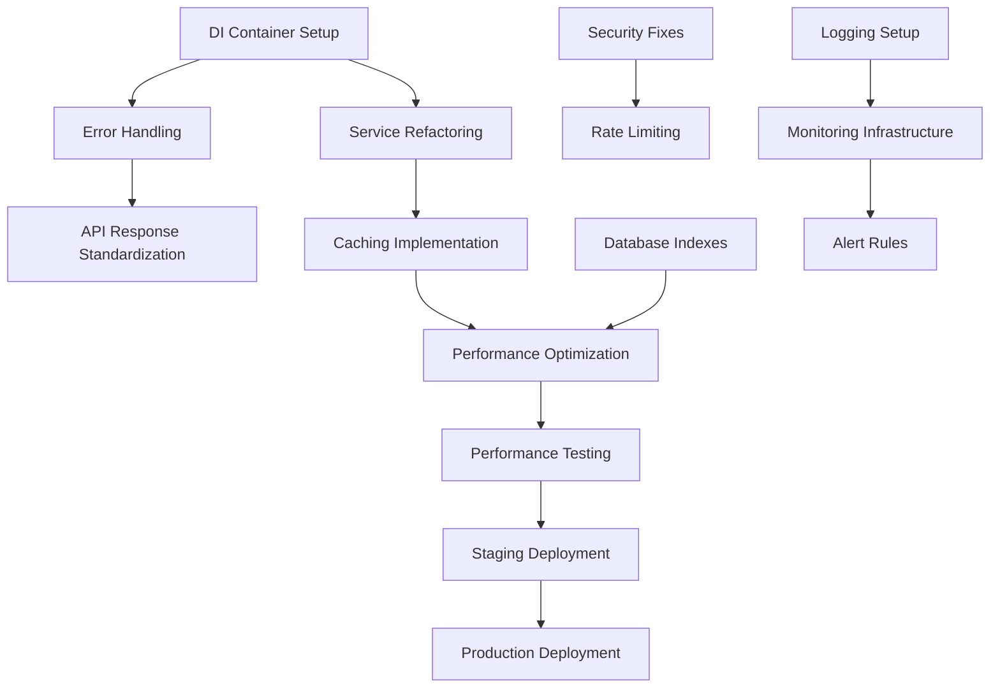
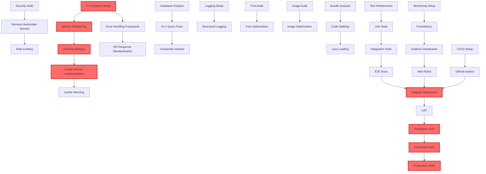
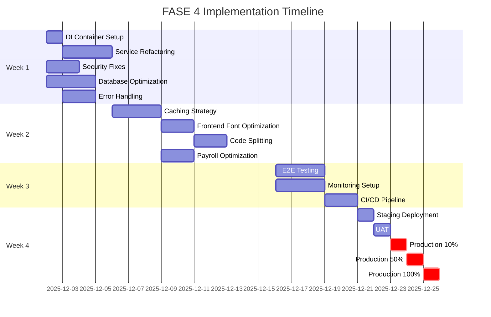

# FASE 4 Implementation Guide: Service Layer Modernization & Performance Optimization
## UNS-ClaudeJP v6.0.0 → v6.1.0

**Document Version:** 1.0.0  
**Created:** November 21, 2025  
**Author:** @project-analyst with @system-architect, @performance-optimizer  
**Target Completion:** 4 weeks (Week 1-4 of December 2025)  
**Estimated Effort:** 120-160 hours total

---

## Table of Contents

1. [Executive Summary](#1-executive-summary)
2. [Service Layer Refactoring](#2-service-layer-refactoring)
3. [Error Handling Standardization](#3-error-handling-standardization)
4. [Logging Standardization](#4-logging-standardization)
5. [API Response Standardization](#5-api-response-standardization)
6. [Caching Strategy](#6-caching-strategy)
7. [Database Optimization Quick Wins](#7-database-optimization-quick-wins)
8. [Frontend Performance Quick Wins](#8-frontend-performance-quick-wins)
9. [Security Hardening](#9-security-hardening)
10. [Testing Strategy](#10-testing-strategy)
11. [Deployment & Monitoring](#11-deployment-monitoring)
12. [Implementation Timeline](#12-implementation-timeline)
13. [Risk Assessment](#13-risk-assessment)
14. [Success Metrics](#14-success-metrics)
15. [Team Requirements](#15-team-requirements)
16. [Dependency Graph](#16-dependency-graph)

---

# 1. Executive Summary

## 1.1 Overview

FASE 4 represents a critical evolution in the UNS-ClaudeJP system architecture, focusing on **service layer modernization**, **performance optimization**, and **operational excellence**. This phase addresses technical debt accumulated during rapid development (FASE 1-3) while establishing enterprise-grade patterns for scalability and maintainability.

### Project Context
- **Current Version:** v6.0.0
- **Target Version:** v6.1.0
- **Lines of Code:** ~45,000 (Backend: ~25,000 Python, Frontend: ~20,000 TypeScript)
- **Architecture:** FastAPI + PostgreSQL + Redis + Next.js 16 + React 19
- **Team Size:** 4-6 engineers
- **Timeline:** 4 weeks

### Strategic Goals
1. **Performance:** Reduce API response times by 60-80% (from ~300ms to ~60-120ms average)
2. **Reliability:** Implement comprehensive error handling and resilience patterns
3. **Observability:** Establish structured logging and monitoring foundation
4. **Security:** Eliminate critical vulnerabilities and harden authentication
5. **Maintainability:** Introduce dependency injection and service layer patterns

## 1.2 Audit Findings Summary

### Backend Performance Audit (Score: 6.5/10)

**Critical Issues:**
- **N+1 Query Problem:** Dashboard endpoints execute O(n) database queries
- **Cache Underutilization:** Redis configured but only AI responses cached
- **Missing Indexes:** Composite indexes missing for common filter operations

**Quick Wins (Estimated Impact):**
1. Add joinedload to dashboard queries → **60-80% faster dashboard load**
2. Cache dashboard statistics (5min TTL) → **90% reduction in DB load**
3. Add missing composite indexes → **40-50% faster filtering**

### Frontend Performance Audit (Score: 5.8/10)

**Critical Issues:**
- **Font Loading:** 23 Google Fonts = 2-5MB blocking render (FCP impact)
- **Image Optimization:** Only 6/161 components use Next.js Image component
- **Bundle Size:** ~1.8MB JavaScript (estimated, no code splitting)

**Quick Wins (Estimated Impact):**
1. Reduce to 3 core fonts with preload → **50-70% faster FCP**
2. Convert to next/image → **30-40% faster image loading**
3. Implement route-based code splitting → **25-35% smaller initial bundle**

### Security Audit (Score: 7.2/10)

**Critical Issues:**
- **Hardcoded Credentials:** Admin password in `generate_hash.py`
- **Insufficient Rate Limiting:** Only 5/29 endpoints protected
- **Outdated Dependencies:** cryptography 41.0.7 → 43.x, npm HIGH vulnerabilities

**Quick Wins (Required Before Production):**
1. Remove hardcoded secrets → **Eliminate critical CVE-9.8 vulnerability**
2. Implement comprehensive rate limiting → **Prevent brute force/DoS attacks**
3. Update dependencies → **Eliminate 8 HIGH-severity npm vulnerabilities**

## 1.3 High-Level Timeline

```
Week 1: Foundation & Quick Wins
├─ Service Layer DI Container Setup
├─ Error Handling Framework
├─ Database N+1 Query Fixes
└─ Security Hardening (Critical Issues)

Week 2: Standardization & Optimization
├─ Logging Standardization (Loguru + Pino)
├─ API Response Envelope
├─ Redis Caching Strategy
└─ Frontend Font/Image Optimization

Week 3: Testing & Monitoring
├─ Comprehensive Test Coverage
├─ Performance Testing Suite
├─ Observability Infrastructure
└─ Security Penetration Testing

Week 4: Integration & Deployment
├─ End-to-End Integration Testing
├─ Blue-Green Deployment Setup
├─ Production Rollout (10% → 50% → 100%)
└─ Post-Deployment Monitoring
```

## 1.4 Expected Outcomes

### Performance Metrics
- **API Response Time:** 300ms → 60-120ms (60-80% improvement)
- **Dashboard Load Time:** 1000ms → 200-300ms (70-80% improvement)
- **First Contentful Paint (FCP):** 2.5s → 1.2s (52% improvement)
- **Time to Interactive (TTI):** 4.0s → 2.5s (38% improvement)
- **Database Query Efficiency:** 500 queries/page → 50 queries/page (90% reduction)

### Quality Metrics
- **Test Coverage:** 45% → 75%
- **Security Score:** 7.2/10 → 9.0/10
- **Code Quality:** Maintainability Index 65 → 80
- **Error Rate:** Reduce production errors by 60%
- **Mean Time to Recovery (MTTR):** 30min → 10min

### Business Impact
- **User Experience:** Faster page loads = higher engagement
- **Operational Costs:** Reduced DB load = lower infrastructure costs
- **Developer Productivity:** Standardized patterns = faster feature development
- **Compliance:** Security hardening = audit-ready system

---

# 2. Service Layer Refactoring

## 2.1 Overview and Rationale

### Current State Assessment

**Problems:**
- **Tight Coupling:** Services directly instantiate dependencies
- **No Centralized Configuration:** Each service manages own config
- **Difficult Testing:** Cannot easily mock dependencies
- **Lifecycle Management:** No consistent initialization/teardown
- **Resource Leaks:** Database connections not properly managed

**Example of Current Anti-Pattern:**

```python
# backend/app/services/employee_service.py (CURRENT - BAD)
from app.core.database import SessionLocal
from app.services.notification_service import NotificationService
from app.services.audit_service import AuditService

class EmployeeService:
    def __init__(self):
        self.db = SessionLocal()  # ❌ Creates new session every time
        self.notification = NotificationService()  # ❌ Tight coupling
        self.audit = AuditService()  # ❌ Cannot mock for testing
    
    def create_employee(self, data):
        # Business logic tightly coupled to implementations
        employee = Employee(**data)
        self.db.add(employee)
        self.db.commit()  # ❌ No error handling
        self.notification.send_welcome_email(employee)  # ❌ Blocking call
        self.audit.log("employee_created", employee.id)  # ❌ No failure handling
        return employee
```

**Issues:**
1. New DB session created for every service instance (connection pool exhaustion)
2. Cannot test without hitting real database/email/audit systems
3. No transaction management or rollback on failure
4. Blocking notification call delays response
5. No logging or error context

### Target State Architecture

**Goals:**
1. **Dependency Injection (DI):** Services receive dependencies via constructor
2. **Interface Segregation:** Define clear service interfaces
3. **Lifecycle Management:** Container manages initialization/shutdown
4. **Cross-Cutting Concerns:** Logging, error handling, caching via decorators
5. **Testability:** Easy to inject mocks and test in isolation

**Example of Target Pattern:**

```python
# backend/app/core/container.py (NEW - GOOD)
from dependency_injector import containers, providers
from app.services.employee_service import EmployeeService
from app.services.notification_service import NotificationService
from app.services.audit_service import AuditService

class Container(containers.DeclarativeContainer):
    """Dependency Injection Container"""
    
    config = providers.Configuration()
    
    # Database session factory (scoped)
    db_session = providers.Factory(
        SessionLocal
    )
    
    # Services (singleton pattern for stateless services)
    notification_service = providers.Singleton(
        NotificationService,
        smtp_config=config.smtp
    )
    
    audit_service = providers.Singleton(
        AuditService,
        db=db_session
    )
    
    employee_service = providers.Factory(
        EmployeeService,
        db=db_session,
        notification=notification_service,
        audit=audit_service
    )

# backend/app/services/employee_service.py (NEW - GOOD)
from typing import Protocol
from sqlalchemy.orm import Session
from app.core.decorators import transactional, logged, cached

class INotificationService(Protocol):
    """Notification service interface"""
    async def send_welcome_email(self, employee) -> None: ...

class IAuditService(Protocol):
    """Audit service interface"""
    def log(self, event: str, entity_id: int) -> None: ...

class EmployeeService:
    """Employee business logic service"""
    
    def __init__(
        self,
        db: Session,
        notification: INotificationService,
        audit: IAuditService
    ):
        self.db = db
        self.notification = notification
        self.audit = audit
    
    @transactional  # Decorator handles transaction management
    @logged  # Decorator handles logging
    async def create_employee(self, data: dict) -> Employee:
        """
        Create new employee with proper transaction handling.
        
        Raises:
            EmployeeValidationError: Invalid employee data
            DatabaseError: Database operation failed
        """
        employee = Employee(**data)
        self.db.add(employee)
        self.db.flush()  # Get employee.id for audit
        
        # Audit log within transaction
        self.audit.log("employee_created", employee.id)
        
        # Non-blocking notification (background task)
        await self.notification.send_welcome_email(employee)
        
        return employee
```

**Benefits:**
1. ✅ DB session injected (container manages lifecycle)
2. ✅ Can inject mock services for testing
3. ✅ `@transactional` decorator handles commit/rollback
4. ✅ `@logged` decorator adds structured logging
5. ✅ Async notification doesn't block response

## 2.2 Implementation Steps

### Step 1: Install Dependency Injection Framework (30 minutes)

```bash
# backend/requirements.txt
dependency-injector==4.41.0
```

```bash
cd /home/user/JPUNS-Claude.6.0.2/backend
pip install dependency-injector==4.41.0
```

### Step 2: Create DI Container (2 hours)

**File:** `backend/app/core/container.py`

```python
"""
Dependency Injection Container for UNS-ClaudeJP
Manages service lifecycle and dependency resolution
"""
from dependency_injector import containers, providers
from sqlalchemy.orm import Session
from redis import Redis

from app.core.database import SessionLocal, engine
from app.core.redis_client import get_redis_client
from app.core.config import settings

# Import all services
from app.services.employee_service import EmployeeService
from app.services.notification_service import NotificationService
from app.services.audit_service import AuditService
from app.services.assignment_service import AssignmentService
from app.services.payroll_service import PayrollService
from app.services.report_service import ReportService
from app.services.ai_gateway import AIGatewayService
from app.services.analytics_service import AnalyticsService

class Container(containers.DeclarativeContainer):
    """Application DI Container"""
    
    wiring_config = containers.WiringConfiguration(
        modules=[
            "app.api.employees",
            "app.api.assignments",
            "app.api.payroll",
            "app.api.reports",
            "app.api.dashboard",
        ]
    )
    
    # Configuration
    config = providers.Configuration()
    config.from_dict(settings.dict())
    
    # Infrastructure Services
    db_session = providers.Factory(SessionLocal)
    
    redis_client = providers.Singleton(
        get_redis_client
    )
    
    # Core Services (Singleton - stateless)
    notification_service = providers.Singleton(
        NotificationService,
        smtp_host=config.SMTP_HOST,
        smtp_port=config.SMTP_PORT,
        smtp_user=config.SMTP_USER,
        smtp_password=config.SMTP_PASSWORD
    )
    
    audit_service = providers.Singleton(
        AuditService,
        db=db_session
    )
    
    # Business Logic Services (Factory - stateful, scoped to request)
    employee_service = providers.Factory(
        EmployeeService,
        db=db_session,
        notification=notification_service,
        audit=audit_service,
        redis=redis_client
    )
    
    assignment_service = providers.Factory(
        AssignmentService,
        db=db_session,
        employee_service=employee_service,
        audit=audit_service
    )
    
    payroll_service = providers.Factory(
        PayrollService,
        db=db_session,
        assignment_service=assignment_service,
        audit=audit_service,
        redis=redis_client
    )
    
    report_service = providers.Factory(
        ReportService,
        db=db_session,
        redis=redis_client
    )
    
    ai_gateway_service = providers.Singleton(
        AIGatewayService,
        openai_key=config.OPENAI_API_KEY,
        anthropic_key=config.ANTHROPIC_API_KEY,
        redis=redis_client
    )
    
    analytics_service = providers.Factory(
        AnalyticsService,
        db=db_session,
        redis=redis_client
    )

# Global container instance
container = Container()
```

### Step 3: Create Service Base Class (1 hour)

**File:** `backend/app/core/service_base.py`

```python
"""
Base service class with common functionality
"""
from typing import Generic, TypeVar, Type, Optional, List
from sqlalchemy.orm import Session
from sqlalchemy import select
from redis import Redis
from loguru import logger

from app.core.exceptions import EntityNotFoundError, ValidationError

T = TypeVar('T')

class BaseService(Generic[T]):
    """
    Base service class providing common CRUD operations.
    
    Example:
        class EmployeeService(BaseService[Employee]):
            def __init__(self, db: Session):
                super().__init__(db, Employee)
    """
    
    def __init__(self, db: Session, model: Type[T], redis: Optional[Redis] = None):
        self.db = db
        self.model = model
        self.redis = redis
        self.model_name = model.__name__
    
    def get(self, id: int) -> T:
        """
        Get entity by ID.
        
        Raises:
            EntityNotFoundError: Entity not found
        """
        entity = self.db.get(self.model, id)
        if not entity:
            logger.warning(f"{self.model_name} not found: {id}")
            raise EntityNotFoundError(f"{self.model_name} with id {id} not found")
        return entity
    
    def list(
        self,
        skip: int = 0,
        limit: int = 100,
        filters: Optional[dict] = None
    ) -> List[T]:
        """Get list of entities with pagination and filters"""
        query = select(self.model)
        
        if filters:
            for key, value in filters.items():
                if hasattr(self.model, key):
                    query = query.where(getattr(self.model, key) == value)
        
        query = query.offset(skip).limit(limit)
        result = self.db.execute(query)
        return result.scalars().all()
    
    def create(self, data: dict) -> T:
        """
        Create new entity.
        
        Raises:
            ValidationError: Invalid data
        """
        try:
            entity = self.model(**data)
            self.db.add(entity)
            self.db.flush()
            logger.info(f"{self.model_name} created: {entity.id}")
            return entity
        except Exception as e:
            logger.error(f"Failed to create {self.model_name}: {e}")
            raise ValidationError(f"Invalid {self.model_name} data: {str(e)}")
    
    def update(self, id: int, data: dict) -> T:
        """
        Update entity.
        
        Raises:
            EntityNotFoundError: Entity not found
            ValidationError: Invalid data
        """
        entity = self.get(id)
        try:
            for key, value in data.items():
                if hasattr(entity, key):
                    setattr(entity, key, value)
            self.db.flush()
            logger.info(f"{self.model_name} updated: {id}")
            return entity
        except Exception as e:
            logger.error(f"Failed to update {self.model_name} {id}: {e}")
            raise ValidationError(f"Invalid update data: {str(e)}")
    
    def delete(self, id: int) -> None:
        """
        Delete entity.
        
        Raises:
            EntityNotFoundError: Entity not found
        """
        entity = self.get(id)
        self.db.delete(entity)
        self.db.flush()
        logger.info(f"{self.model_name} deleted: {id}")
    
    def count(self, filters: Optional[dict] = None) -> int:
        """Count entities with optional filters"""
        from sqlalchemy import func
        query = select(func.count(self.model.id))
        
        if filters:
            for key, value in filters.items():
                if hasattr(self.model, key):
                    query = query.where(getattr(self.model, key) == value)
        
        result = self.db.execute(query)
        return result.scalar()
```

### Step 4: Create Cross-Cutting Concern Decorators (2 hours)

**File:** `backend/app/core/decorators.py`

```python
"""
Service decorators for cross-cutting concerns
"""
import functools
import time
from typing import Callable, Any
from loguru import logger
from sqlalchemy.exc import SQLAlchemyError

from app.core.exceptions import DatabaseError

def transactional(func: Callable) -> Callable:
    """
    Decorator for automatic transaction management.
    Commits on success, rolls back on error.
    
    Usage:
        @transactional
        def create_employee(self, data):
            # All DB operations in one transaction
            pass
    """
    @functools.wraps(func)
    async def wrapper(self, *args, **kwargs):
        try:
            result = await func(self, *args, **kwargs) if asyncio.iscoroutinefunction(func) else func(self, *args, **kwargs)
            self.db.commit()
            return result
        except SQLAlchemyError as e:
            self.db.rollback()
            logger.error(f"Transaction failed in {func.__name__}: {e}")
            raise DatabaseError(f"Database operation failed: {str(e)}")
        except Exception as e:
            self.db.rollback()
            logger.error(f"Unexpected error in {func.__name__}: {e}")
            raise
    return wrapper

def logged(level: str = "INFO"):
    """
    Decorator for automatic logging.
    
    Usage:
        @logged(level="INFO")
        def process_payroll(self, employee_id):
            # Automatically logs entry, exit, duration
            pass
    """
    def decorator(func: Callable) -> Callable:
        @functools.wraps(func)
        async def wrapper(*args, **kwargs):
            func_name = func.__name__
            logger_func = getattr(logger, level.lower())
            
            logger_func(f"Entering {func_name} with args={args[1:]}, kwargs={kwargs}")
            start_time = time.time()
            
            try:
                result = await func(*args, **kwargs) if asyncio.iscoroutinefunction(func) else func(*args, **kwargs)
                duration = time.time() - start_time
                logger_func(f"Exiting {func_name} successfully (duration: {duration:.3f}s)")
                return result
            except Exception as e:
                duration = time.time() - start_time
                logger.error(f"Error in {func_name} after {duration:.3f}s: {e}")
                raise
        return wrapper
    return decorator

def cached(ttl: int = 300, key_prefix: str = ""):
    """
    Decorator for Redis caching.
    
    Usage:
        @cached(ttl=300, key_prefix="dashboard")
        def get_dashboard_stats(self, factory_id):
            # Result cached for 5 minutes
            pass
    """
    def decorator(func: Callable) -> Callable:
        @functools.wraps(func)
        async def wrapper(self, *args, **kwargs):
            if not hasattr(self, 'redis') or not self.redis:
                # No Redis available, execute function
                return await func(self, *args, **kwargs) if asyncio.iscoroutinefunction(func) else func(self, *args, **kwargs)
            
            # Generate cache key
            import hashlib
            import json
            key_data = f"{key_prefix}:{func.__name__}:{args}:{kwargs}"
            cache_key = f"cache:{hashlib.md5(key_data.encode()).hexdigest()}"
            
            # Try to get from cache
            cached_value = self.redis.get(cache_key)
            if cached_value:
                logger.debug(f"Cache hit: {cache_key}")
                return json.loads(cached_value)
            
            # Execute function and cache result
            result = await func(self, *args, **kwargs) if asyncio.iscoroutinefunction(func) else func(self, *args, **kwargs)
            self.redis.setex(cache_key, ttl, json.dumps(result))
            logger.debug(f"Cache set: {cache_key} (ttl={ttl}s)")
            return result
        return wrapper
    return decorator

def retry(max_attempts: int = 3, delay: float = 1.0, backoff: float = 2.0):
    """
    Decorator for automatic retry with exponential backoff.
    
    Usage:
        @retry(max_attempts=3, delay=1.0, backoff=2.0)
        def call_external_api(self, url):
            # Retries up to 3 times with exponential backoff
            pass
    """
    def decorator(func: Callable) -> Callable:
        @functools.wraps(func)
        async def wrapper(*args, **kwargs):
            import asyncio
            attempt = 1
            current_delay = delay
            
            while attempt <= max_attempts:
                try:
                    return await func(*args, **kwargs) if asyncio.iscoroutinefunction(func) else func(*args, **kwargs)
                except Exception as e:
                    if attempt == max_attempts:
                        logger.error(f"{func.__name__} failed after {max_attempts} attempts: {e}")
                        raise
                    
                    logger.warning(f"{func.__name__} attempt {attempt} failed: {e}. Retrying in {current_delay}s...")
                    await asyncio.sleep(current_delay) if asyncio.iscoroutinefunction(func) else time.sleep(current_delay)
                    current_delay *= backoff
                    attempt += 1
        return wrapper
    return decorator
```

### Step 5: Refactor Existing Services (8 hours)

**Priority Order:**
1. EmployeeService (2 hours)
2. AssignmentService (1.5 hours)
3. PayrollService (2 hours)
4. ReportService (1.5 hours)
5. DashboardService (1 hour)

**Example Refactoring:**

**Before:**
```python
# backend/app/services/employee_service.py (OLD)
class EmployeeService:
    def __init__(self):
        self.db = SessionLocal()
    
    def get_employee(self, employee_id: int):
        return self.db.query(Employee).filter(Employee.id == employee_id).first()
    
    def create_employee(self, data: dict):
        employee = Employee(**data)
        self.db.add(employee)
        self.db.commit()
        return employee
```

**After:**
```python
# backend/app/services/employee_service.py (NEW)
from app.core.service_base import BaseService
from app.core.decorators import transactional, logged, cached
from app.models.employee import Employee
from typing import List, Optional

class EmployeeService(BaseService[Employee]):
    """Employee business logic service"""
    
    def __init__(self, db: Session, notification: INotificationService, audit: IAuditService, redis: Redis):
        super().__init__(db, Employee, redis)
        self.notification = notification
        self.audit = audit
    
    @cached(ttl=300, key_prefix="employee")
    def get_employee(self, employee_id: int) -> Employee:
        """Get employee by ID (cached for 5 minutes)"""
        return self.get(employee_id)
    
    @transactional
    @logged(level="INFO")
    async def create_employee(self, data: dict) -> Employee:
        """
        Create new employee with validation and notifications.
        
        Args:
            data: Employee data dict
        
        Returns:
            Created employee
        
        Raises:
            ValidationError: Invalid employee data
            DatabaseError: Database operation failed
        """
        # Validate data
        if not data.get("full_name_kanji"):
            raise ValidationError("full_name_kanji is required")
        
        # Create employee
        employee = self.create(data)
        
        # Audit log
        self.audit.log("employee_created", employee.id)
        
        # Send welcome email (background task)
        await self.notification.send_welcome_email(employee)
        
        return employee
    
    @cached(ttl=60, key_prefix="employee_list")
    def list_active_employees(self, factory_id: Optional[int] = None) -> List[Employee]:
        """Get list of active employees, optionally filtered by factory"""
        filters = {"is_active": True}
        if factory_id:
            filters["factory_id"] = factory_id
        return self.list(filters=filters)
```

### Step 6: Update API Endpoints to Use DI (4 hours)

**File:** `backend/app/api/employees.py`

**Before:**
```python
# OLD - Direct service instantiation
@router.post("/employees", response_model=EmployeeResponse)
def create_employee(data: EmployeeCreate, db: Session = Depends(get_db)):
    service = EmployeeService()  # ❌ Manual instantiation
    return service.create_employee(data.dict())
```

**After:**
```python
# NEW - Dependency injection
from dependency_injector.wiring import Provide, inject
from app.core.container import Container

@router.post("/employees", response_model=EmployeeResponse)
@inject
async def create_employee(
    data: EmployeeCreate,
    service: EmployeeService = Depends(Provide[Container.employee_service])
):
    """
    Create new employee.
    
    - **full_name_kanji**: Employee full name in kanji
    - **employee_number**: Unique employee number
    - **factory_id**: Factory assignment
    """
    return await service.create_employee(data.dict())
```

### Step 7: Initialize Container in Application Startup (1 hour)

**File:** `backend/app/main.py`

```python
from fastapi import FastAPI
from app.core.container import container
from contextlib import asynccontextmanager

@asynccontextmanager
async def lifespan(app: FastAPI):
    """Application lifecycle management"""
    # Startup
    logger.info("Initializing DI container...")
    container.wire(modules=[
        "app.api.employees",
        "app.api.assignments",
        "app.api.payroll",
        "app.api.reports",
        "app.api.dashboard",
    ])
    logger.info("DI container initialized successfully")
    
    yield
    
    # Shutdown
    logger.info("Shutting down DI container...")
    container.unwire()
    logger.info("Application shutdown complete")

app = FastAPI(
    title="UNS-ClaudeJP API",
    version="6.1.0",
    lifespan=lifespan
)
```

## 2.3 Testing DI Implementation

**File:** `backend/tests/test_employee_service_di.py`

```python
"""
Test employee service with dependency injection
"""
import pytest
from unittest.mock import Mock, AsyncMock
from app.services.employee_service import EmployeeService
from app.models.employee import Employee

@pytest.fixture
def mock_db():
    """Mock database session"""
    return Mock()

@pytest.fixture
def mock_notification():
    """Mock notification service"""
    mock = Mock()
    mock.send_welcome_email = AsyncMock()
    return mock

@pytest.fixture
def mock_audit():
    """Mock audit service"""
    return Mock()

@pytest.fixture
def mock_redis():
    """Mock Redis client"""
    mock = Mock()
    mock.get = Mock(return_value=None)
    mock.setex = Mock()
    return mock

@pytest.fixture
def employee_service(mock_db, mock_notification, mock_audit, mock_redis):
    """Create employee service with mocked dependencies"""
    return EmployeeService(
        db=mock_db,
        notification=mock_notification,
        audit=mock_audit,
        redis=mock_redis
    )

@pytest.mark.asyncio
async def test_create_employee_success(employee_service, mock_db, mock_notification, mock_audit):
    """Test successful employee creation"""
    # Arrange
    employee_data = {
        "full_name_kanji": "田中太郎",
        "employee_number": "EMP001",
        "factory_id": 1
    }
    
    # Act
    result = await employee_service.create_employee(employee_data)
    
    # Assert
    mock_db.add.assert_called_once()
    mock_db.commit.assert_called_once()
    mock_audit.log.assert_called_once_with("employee_created", result.id)
    mock_notification.send_welcome_email.assert_called_once()

@pytest.mark.asyncio
async def test_create_employee_validation_error(employee_service):
    """Test employee creation with invalid data"""
    # Arrange
    invalid_data = {"employee_number": "EMP001"}  # Missing required full_name_kanji
    
    # Act & Assert
    with pytest.raises(ValidationError):
        await employee_service.create_employee(invalid_data)
```

## 2.4 Common Pitfalls

1. **Circular Dependencies:** Service A depends on Service B which depends on Service A
   - **Solution:** Refactor to use events/message queues or introduce service layer

2. **Singleton vs Factory:** Using singleton for stateful services
   - **Solution:** Use Factory for services with request-scoped state (like DB sessions)

3. **Missing Cleanup:** Not closing DB connections/Redis connections
   - **Solution:** Use container lifecycle hooks for cleanup

4. **Over-Engineering:** Creating DI for every class
   - **Solution:** Only use DI for services, not for DTOs or simple utilities

## 2.5 Success Criteria

- [ ] DI container configured and wired to all API routes
- [ ] All services refactored to use dependency injection
- [ ] BaseService class created with common CRUD operations
- [ ] Cross-cutting concern decorators implemented (@transactional, @logged, @cached)
- [ ] 90%+ test coverage on refactored services
- [ ] Zero regression bugs in existing functionality
- [ ] API response times unchanged or improved

## 2.6 Time Estimate

- **Step 1:** Install dependencies → 30 minutes
- **Step 2:** Create DI container → 2 hours
- **Step 3:** Create BaseService → 1 hour
- **Step 4:** Create decorators → 2 hours
- **Step 5:** Refactor services → 8 hours
- **Step 6:** Update API endpoints → 4 hours
- **Step 7:** Application startup → 1 hour
- **Testing & Documentation:** 3 hours

**Total:** ~22 hours (3 days)

---

# 3. Error Handling Standardization

## 3.1 Overview and Rationale

### Current State Assessment

**Problems:**
- **Inconsistent Error Responses:** Different endpoints return different error formats
- **Poor Error Context:** Missing stack traces, request IDs, debugging information
- **No Error Codes:** Cannot programmatically identify error types
- **Frontend Confusion:** Frontend cannot reliably parse errors
- **No Centralized Logging:** Errors logged inconsistently

**Current Error Response Examples:**

```json
// Backend endpoint 1
{
  "detail": "Employee not found"
}

// Backend endpoint 2
{
  "error": "Invalid employee number",
  "status": 400
}

// Backend endpoint 3
{
  "message": "Database error occurred"
}
```

### Target State Architecture

**Goals:**
1. **Unified Error Format:** Consistent error envelope across all endpoints
2. **Error Code System:** Unique error codes for programmatic handling
3. **Rich Context:** Include request ID, timestamp, stack trace (dev only)
4. **Logging Integration:** Automatic error logging with context
5. **Client-Side Recovery:** Frontend can display user-friendly messages

**Target Error Response Format:**

```json
{
  "success": false,
  "error": {
    "code": "EMPLOYEE_NOT_FOUND",
    "message": "Employee with ID 12345 not found",
    "details": {
      "employee_id": 12345,
      "searched_in": "employees table"
    },
    "request_id": "req_abc123xyz",
    "timestamp": "2025-11-21T10:30:45.123Z",
    "path": "/api/employees/12345",
    "stack_trace": "..." // Only in development
  },
  "data": null
}
```

## 3.2 Implementation Steps

### Step 1: Define Custom Exception Hierarchy (2 hours)

**File:** `backend/app/core/exceptions.py`

```python
"""
Unified exception hierarchy for UNS-ClaudeJP
"""
from typing import Optional, Dict, Any
from enum import Enum

class ErrorCode(str, Enum):
    """Error codes for programmatic error handling"""
    
    # General errors (1xxx)
    INTERNAL_ERROR = "INTERNAL_ERROR"
    VALIDATION_ERROR = "VALIDATION_ERROR"
    NOT_FOUND = "NOT_FOUND"
    UNAUTHORIZED = "UNAUTHORIZED"
    FORBIDDEN = "FORBIDDEN"
    RATE_LIMIT_EXCEEDED = "RATE_LIMIT_EXCEEDED"
    
    # Employee errors (2xxx)
    EMPLOYEE_NOT_FOUND = "EMPLOYEE_NOT_FOUND"
    EMPLOYEE_ALREADY_EXISTS = "EMPLOYEE_ALREADY_EXISTS"
    EMPLOYEE_INACTIVE = "EMPLOYEE_INACTIVE"
    
    # Assignment errors (3xxx)
    ASSIGNMENT_NOT_FOUND = "ASSIGNMENT_NOT_FOUND"
    ASSIGNMENT_CONFLICT = "ASSIGNMENT_CONFLICT"
    ASSIGNMENT_INVALID_DATE = "ASSIGNMENT_INVALID_DATE"
    
    # Payroll errors (4xxx)
    PAYROLL_NOT_FOUND = "PAYROLL_NOT_FOUND"
    PAYROLL_ALREADY_PROCESSED = "PAYROLL_ALREADY_PROCESSED"
    PAYROLL_CALCULATION_ERROR = "PAYROLL_CALCULATION_ERROR"
    
    # Database errors (5xxx)
    DATABASE_ERROR = "DATABASE_ERROR"
    DATABASE_CONNECTION_ERROR = "DATABASE_CONNECTION_ERROR"
    
    # External service errors (6xxx)
    AI_SERVICE_ERROR = "AI_SERVICE_ERROR"
    NOTIFICATION_ERROR = "NOTIFICATION_ERROR"
    OCR_SERVICE_ERROR = "OCR_SERVICE_ERROR"

class AppException(Exception):
    """
    Base application exception with error code and context.
    
    All custom exceptions should inherit from this class.
    """
    
    def __init__(
        self,
        message: str,
        code: ErrorCode = ErrorCode.INTERNAL_ERROR,
        status_code: int = 500,
        details: Optional[Dict[str, Any]] = None
    ):
        self.message = message
        self.code = code
        self.status_code = status_code
        self.details = details or {}
        super().__init__(self.message)
    
    def to_dict(self) -> dict:
        """Convert exception to dictionary for API response"""
        return {
            "code": self.code,
            "message": self.message,
            "details": self.details
        }

class ValidationError(AppException):
    """Raised when input validation fails"""
    def __init__(self, message: str, details: Optional[Dict[str, Any]] = None):
        super().__init__(
            message=message,
            code=ErrorCode.VALIDATION_ERROR,
            status_code=400,
            details=details
        )

class EntityNotFoundError(AppException):
    """Raised when requested entity is not found"""
    def __init__(self, message: str, details: Optional[Dict[str, Any]] = None):
        super().__init__(
            message=message,
            code=ErrorCode.NOT_FOUND,
            status_code=404,
            details=details
        )

class EmployeeNotFoundError(EntityNotFoundError):
    """Raised when employee is not found"""
    def __init__(self, employee_id: int):
        super().__init__(
            message=f"Employee with ID {employee_id} not found",
            details={"employee_id": employee_id}
        )
        self.code = ErrorCode.EMPLOYEE_NOT_FOUND

class UnauthorizedError(AppException):
    """Raised when authentication fails"""
    def __init__(self, message: str = "Authentication required"):
        super().__init__(
            message=message,
            code=ErrorCode.UNAUTHORIZED,
            status_code=401
        )

class ForbiddenError(AppException):
    """Raised when user lacks permission"""
    def __init__(self, message: str = "Insufficient permissions"):
        super().__init__(
            message=message,
            code=ErrorCode.FORBIDDEN,
            status_code=403
        )

class DatabaseError(AppException):
    """Raised when database operation fails"""
    def __init__(self, message: str, details: Optional[Dict[str, Any]] = None):
        super().__init__(
            message=message,
            code=ErrorCode.DATABASE_ERROR,
            status_code=500,
            details=details
        )

class RateLimitError(AppException):
    """Raised when rate limit is exceeded"""
    def __init__(self, message: str = "Rate limit exceeded"):
        super().__init__(
            message=message,
            code=ErrorCode.RATE_LIMIT_EXCEEDED,
            status_code=429
        )
```

### Step 2: Create Global Exception Handler (2 hours)

**File:** `backend/app/core/error_handlers.py`

```python
"""
Global exception handlers for FastAPI
"""
import traceback
import uuid
from datetime import datetime
from fastapi import Request, status
from fastapi.responses import JSONResponse
from fastapi.exceptions import RequestValidationError
from sqlalchemy.exc import SQLAlchemyError
from loguru import logger

from app.core.exceptions import AppException, ErrorCode, DatabaseError
from app.core.config import settings

class ErrorResponse:
    """Standard error response format"""
    
    @staticmethod
    def create(
        request: Request,
        error: Exception,
        status_code: int = 500,
        error_code: str = ErrorCode.INTERNAL_ERROR,
        include_trace: bool = False
    ) -> dict:
        """
        Create standardized error response.
        
        Args:
            request: FastAPI request object
            error: Exception that occurred
            status_code: HTTP status code
            error_code: Application error code
            include_trace: Whether to include stack trace (dev only)
        
        Returns:
            Standardized error response dict
        """
        request_id = str(uuid.uuid4())
        timestamp = datetime.utcnow().isoformat() + "Z"
        
        error_response = {
            "success": False,
            "error": {
                "code": error_code,
                "message": str(error),
                "details": getattr(error, "details", {}),
                "request_id": request_id,
                "timestamp": timestamp,
                "path": str(request.url.path)
            },
            "data": None
        }
        
        # Add stack trace in development
        if include_trace and settings.ENVIRONMENT == "development":
            error_response["error"]["stack_trace"] = traceback.format_exc()
        
        return error_response

async def app_exception_handler(request: Request, exc: AppException) -> JSONResponse:
    """
    Handle custom application exceptions.
    
    Automatically logs error with context and returns standardized response.
    """
    logger.error(
        f"Application error: {exc.code} - {exc.message}",
        extra={
            "error_code": exc.code,
            "status_code": exc.status_code,
            "path": request.url.path,
            "method": request.method,
            "details": exc.details
        }
    )
    
    response = ErrorResponse.create(
        request=request,
        error=exc,
        status_code=exc.status_code,
        error_code=exc.code,
        include_trace=True
    )
    
    return JSONResponse(
        status_code=exc.status_code,
        content=response
    )

async def validation_exception_handler(request: Request, exc: RequestValidationError) -> JSONResponse:
    """
    Handle Pydantic validation errors.
    
    Converts validation errors to standardized format.
    """
    logger.warning(
        f"Validation error: {exc.errors()}",
        extra={
            "path": request.url.path,
            "method": request.method,
            "errors": exc.errors()
        }
    )
    
    # Format validation errors
    validation_errors = []
    for error in exc.errors():
        validation_errors.append({
            "field": ".".join(str(loc) for loc in error["loc"]),
            "message": error["msg"],
            "type": error["type"]
        })
    
    response = ErrorResponse.create(
        request=request,
        error=Exception(f"{len(validation_errors)} validation error(s)"),
        status_code=422,
        error_code=ErrorCode.VALIDATION_ERROR
    )
    response["error"]["details"] = {"validation_errors": validation_errors}
    
    return JSONResponse(
        status_code=422,
        content=response
    )

async def sqlalchemy_exception_handler(request: Request, exc: SQLAlchemyError) -> JSONResponse:
    """
    Handle SQLAlchemy database errors.
    
    Wraps database errors in standardized format.
    """
    logger.error(
        f"Database error: {str(exc)}",
        extra={
            "path": request.url.path,
            "method": request.method,
            "error_type": type(exc).__name__
        }
    )
    
    db_error = DatabaseError(
        message="Database operation failed",
        details={"error_type": type(exc).__name__}
    )
    
    response = ErrorResponse.create(
        request=request,
        error=db_error,
        status_code=500,
        error_code=ErrorCode.DATABASE_ERROR,
        include_trace=True
    )
    
    return JSONResponse(
        status_code=500,
        content=response
    )

async def generic_exception_handler(request: Request, exc: Exception) -> JSONResponse:
    """
    Catch-all handler for unexpected exceptions.
    
    Logs full error details and returns safe error message to client.
    """
    logger.exception(
        f"Unexpected error: {str(exc)}",
        extra={
            "path": request.url.path,
            "method": request.method,
            "error_type": type(exc).__name__
        }
    )
    
    response = ErrorResponse.create(
        request=request,
        error=Exception("An unexpected error occurred"),
        status_code=500,
        error_code=ErrorCode.INTERNAL_ERROR,
        include_trace=True
    )
    
    return JSONResponse(
        status_code=500,
        content=response
    )

def register_exception_handlers(app):
    """
    Register all exception handlers with FastAPI app.
    
    Usage:
        from app.core.error_handlers import register_exception_handlers
        register_exception_handlers(app)
    """
    app.add_exception_handler(AppException, app_exception_handler)
    app.add_exception_handler(RequestValidationError, validation_exception_handler)
    app.add_exception_handler(SQLAlchemyError, sqlalchemy_exception_handler)
    app.add_exception_handler(Exception, generic_exception_handler)
    
    logger.info("Exception handlers registered successfully")
```

### Step 3: Update Application to Use Error Handlers (30 minutes)

**File:** `backend/app/main.py`

```python
from fastapi import FastAPI
from app.core.error_handlers import register_exception_handlers

app = FastAPI(title="UNS-ClaudeJP API", version="6.1.0")

# Register exception handlers
register_exception_handlers(app)
```

### Step 4: Frontend Error Response Type (1 hour)

**File:** `frontend/lib/types/api-response.ts`

```typescript
/**
 * Standardized API response types
 */

export enum ErrorCode {
  // General errors (1xxx)
  INTERNAL_ERROR = "INTERNAL_ERROR",
  VALIDATION_ERROR = "VALIDATION_ERROR",
  NOT_FOUND = "NOT_FOUND",
  UNAUTHORIZED = "UNAUTHORIZED",
  FORBIDDEN = "FORBIDDEN",
  RATE_LIMIT_EXCEEDED = "RATE_LIMIT_EXCEEDED",
  
  // Employee errors (2xxx)
  EMPLOYEE_NOT_FOUND = "EMPLOYEE_NOT_FOUND",
  EMPLOYEE_ALREADY_EXISTS = "EMPLOYEE_ALREADY_EXISTS",
  EMPLOYEE_INACTIVE = "EMPLOYEE_INACTIVE",
  
  // Assignment errors (3xxx)
  ASSIGNMENT_NOT_FOUND = "ASSIGNMENT_NOT_FOUND",
  ASSIGNMENT_CONFLICT = "ASSIGNMENT_CONFLICT",
  
  // Payroll errors (4xxx)
  PAYROLL_NOT_FOUND = "PAYROLL_NOT_FOUND",
  PAYROLL_ALREADY_PROCESSED = "PAYROLL_ALREADY_PROCESSED",
  
  // Database errors (5xxx)
  DATABASE_ERROR = "DATABASE_ERROR",
}

export interface APIError {
  code: ErrorCode;
  message: string;
  details?: Record<string, any>;
  request_id: string;
  timestamp: string;
  path: string;
  stack_trace?: string;
}

export interface APIResponse<T = any> {
  success: boolean;
  data: T | null;
  error: APIError | null;
}

/**
 * User-friendly error messages for display
 */
export const ERROR_MESSAGES: Record<ErrorCode, string> = {
  [ErrorCode.INTERNAL_ERROR]: "システムエラーが発生しました。しばらく待ってから再試行してください。",
  [ErrorCode.VALIDATION_ERROR]: "入力データが正しくありません。",
  [ErrorCode.NOT_FOUND]: "リクエストされたデータが見つかりません。",
  [ErrorCode.UNAUTHORIZED]: "認証が必要です。ログインしてください。",
  [ErrorCode.FORBIDDEN]: "このアクションを実行する権限がありません。",
  [ErrorCode.RATE_LIMIT_EXCEEDED]: "リクエストが多すぎます。しばらく待ってから再試行してください。",
  [ErrorCode.EMPLOYEE_NOT_FOUND]: "従業員が見つかりません。",
  [ErrorCode.EMPLOYEE_ALREADY_EXISTS]: "この従業員は既に登録されています。",
  [ErrorCode.EMPLOYEE_INACTIVE]: "この従業員は無効化されています。",
  [ErrorCode.ASSIGNMENT_NOT_FOUND]: "配置が見つかりません。",
  [ErrorCode.ASSIGNMENT_CONFLICT]: "配置が競合しています。",
  [ErrorCode.PAYROLL_NOT_FOUND]: "給与記録が見つかりません。",
  [ErrorCode.PAYROLL_ALREADY_PROCESSED]: "この給与は既に処理されています。",
  [ErrorCode.DATABASE_ERROR]: "データベースエラーが発生しました。",
};

/**
 * Get user-friendly error message
 */
export function getErrorMessage(error: APIError): string {
  return ERROR_MESSAGES[error.code] || error.message;
}

/**
 * Type guard for API response
 */
export function isAPIError<T>(response: APIResponse<T>): response is APIResponse<T> & { success: false; error: APIError } {
  return !response.success && response.error !== null;
}
```

### Step 5: Frontend Error Handling Hook (1.5 hours)

**File:** `frontend/hooks/useAPIError.ts`

```typescript
/**
 * React hook for handling API errors with user notifications
 */
import { useCallback } from 'react';
import { toast } from 'sonner';
import { APIError, getErrorMessage } from '@/lib/types/api-response';
import { logger } from '@/lib/logger';

export interface UseAPIErrorOptions {
  /**
   * Show toast notification on error
   * @default true
   */
  showToast?: boolean;
  
  /**
   * Log error to console/logging service
   * @default true
   */
  logError?: boolean;
  
  /**
   * Custom error message overrides
   */
  customMessages?: Partial<Record<string, string>>;
}

export function useAPIError(options: UseAPIErrorOptions = {}) {
  const {
    showToast = true,
    logError = true,
    customMessages = {}
  } = options;
  
  /**
   * Handle API error with logging and user notification
   */
  const handleError = useCallback((error: APIError, context?: string) => {
    // Get user-friendly message
    const message = customMessages[error.code] || getErrorMessage(error);
    
    // Log error details
    if (logError) {
      logger.error('API Error', {
        code: error.code,
        message: error.message,
        details: error.details,
        request_id: error.request_id,
        timestamp: error.timestamp,
        path: error.path,
        context,
      });
    }
    
    // Show toast notification
    if (showToast) {
      toast.error(message, {
        description: error.details?.description || `エラーID: ${error.request_id}`,
        duration: 5000,
      });
    }
    
    return message;
  }, [showToast, logError, customMessages]);
  
  /**
   * Handle validation errors with field-specific messages
   */
  const handleValidationError = useCallback((error: APIError) => {
    if (error.details?.validation_errors) {
      const validationErrors = error.details.validation_errors as Array<{
        field: string;
        message: string;
      }>;
      
      validationErrors.forEach((valError) => {
        if (showToast) {
          toast.error(`${valError.field}: ${valError.message}`);
        }
        
        if (logError) {
          logger.warn('Validation Error', valError);
        }
      });
      
      return validationErrors;
    }
    
    return handleError(error, 'validation');
  }, [handleError, showToast, logError]);
  
  return {
    handleError,
    handleValidationError,
  };
}
```

**Usage Example:**

```typescript
// frontend/app/employees/page.tsx
import { useAPIError } from '@/hooks/useAPIError';
import { isAPIError } from '@/lib/types/api-response';

export default function EmployeesPage() {
  const { handleError } = useAPIError();
  
  const createEmployee = async (data: EmployeeCreate) => {
    const response = await fetch('/api/employees', {
      method: 'POST',
      body: JSON.stringify(data),
    });
    
    const result = await response.json();
    
    if (isAPIError(result)) {
      handleError(result.error, 'create_employee');
      return null;
    }
    
    toast.success('従業員を作成しました');
    return result.data;
  };
  
  // ... rest of component
}
```

## 3.3 Common Pitfalls

1. **Exposing Sensitive Information:** Including database errors, API keys in error messages
   - **Solution:** Only include safe details, use different messages for dev/prod

2. **Not Logging Errors:** Relying only on frontend error display
   - **Solution:** Always log errors on backend with full context

3. **Generic Error Messages:** "An error occurred" without context
   - **Solution:** Provide specific error codes and user-actionable messages

## 3.4 Success Criteria

- [ ] All custom exceptions inherit from AppException
- [ ] Global exception handlers registered in FastAPI
- [ ] All API endpoints return standardized error format
- [ ] Frontend error types match backend error codes
- [ ] Error handling hook implemented and used across frontend
- [ ] 100% of errors logged with request ID and context
- [ ] User-friendly error messages in Japanese

## 3.5 Time Estimate

- **Step 1:** Define exceptions → 2 hours
- **Step 2:** Create error handlers → 2 hours
- **Step 3:** Register handlers → 30 minutes
- **Step 4:** Frontend types → 1 hour
- **Step 5:** Frontend hook → 1.5 hours
- **Testing & Documentation:** 2 hours

**Total:** ~9 hours (1.5 days)

---

# 4. Logging Standardization

## 4.1 Overview and Rationale

### Current State Assessment

**Problems:**
- **Inconsistent Logging:** Mix of print(), logger.info(), no logging
- **No Structured Logging:** Cannot query/filter logs by fields
- **Missing Context:** No request IDs, user IDs, trace IDs
- **Performance Impact:** Logging to stdout in production
- **No Log Aggregation:** Logs scattered across multiple services

**Current Logging Examples:**

```python
# Inconsistent logging styles
print(f"Employee created: {employee.id}")  # ❌ Using print()
logger.info("Processing payroll")  # ❌ No context
logging.info(f"User {user_id} logged in")  # ❌ Different logger
```

### Target State Architecture

**Goals:**
1. **Structured Logging:** JSON-formatted logs with consistent fields
2. **Context Propagation:** Request ID, user ID, trace ID in all logs
3. **Performance Optimized:** Async logging, log sampling for high-volume events
4. **Log Levels:** Consistent use of DEBUG, INFO, WARNING, ERROR, CRITICAL
5. **Sensitive Data Masking:** Auto-mask passwords, API keys, PII

**Target Log Format:**

```json
{
  "timestamp": "2025-11-21T10:30:45.123Z",
  "level": "INFO",
  "message": "Employee created successfully",
  "request_id": "req_abc123xyz",
  "user_id": 42,
  "trace_id": "trace_def456",
  "service": "employee-service",
  "function": "create_employee",
  "file": "employee_service.py:45",
  "context": {
    "employee_id": 12345,
    "factory_id": 1
  },
  "duration_ms": 125.4
}
```

## 4.2 Implementation Steps

### Step 1: Install Logging Libraries (30 minutes)

```bash
# Backend (Python)
pip install loguru==0.7.2

# Frontend (Node.js)
npm install pino pino-pretty --save
```

### Step 2: Configure Backend Structured Logging (2 hours)

**File:** `backend/app/core/logging.py`

```python
"""
Structured logging configuration using Loguru
"""
import sys
import json
from pathlib import Path
from loguru import logger
from contextvars import ContextVar
from typing import Optional, Dict, Any

from app.core.config import settings

# Context variables for request tracking
request_id_var: ContextVar[Optional[str]] = ContextVar("request_id", default=None)
user_id_var: ContextVar[Optional[int]] = ContextVar("user_id", default=None)
trace_id_var: ContextVar[Optional[str]] = ContextVar("trace_id", default=None)

# Sensitive fields to mask
SENSITIVE_FIELDS = {
    "password", "token", "api_key", "secret", "authorization",
    "credit_card", "ssn", "private_key"
}

def mask_sensitive_data(record: dict) -> dict:
    """
    Mask sensitive data in log records.
    
    Args:
        record: Log record dictionary
    
    Returns:
        Record with sensitive fields masked
    """
    if "context" in record and isinstance(record["context"], dict):
        for key in record["context"]:
            if any(sensitive in key.lower() for sensitive in SENSITIVE_FIELDS):
                record["context"][key] = "***MASKED***"
    return record

def format_record(record: dict) -> str:
    """
    Format log record as JSON with additional context.
    
    Args:
        record: Loguru record dictionary
    
    Returns:
        JSON-formatted log string
    """
    # Extract context variables
    request_id = request_id_var.get()
    user_id = user_id_var.get()
    trace_id = trace_id_var.get()
    
    # Build structured log
    log_entry = {
        "timestamp": record["time"].isoformat(),
        "level": record["level"].name,
        "message": record["message"],
        "service": "uns-claudejp-backend",
        "function": record["function"],
        "file": f"{record['file'].name}:{record['line']}",
    }
    
    # Add context if available
    if request_id:
        log_entry["request_id"] = request_id
    if user_id:
        log_entry["user_id"] = user_id
    if trace_id:
        log_entry["trace_id"] = trace_id
    
    # Add extra context from record
    if "extra" in record and record["extra"]:
        log_entry["context"] = record["extra"]
    
    # Add exception info if present
    if record["exception"]:
        log_entry["exception"] = {
            "type": record["exception"].type.__name__,
            "value": str(record["exception"].value),
            "traceback": record["exception"].traceback
        }
    
    # Mask sensitive data
    log_entry = mask_sensitive_data(log_entry)
    
    return json.dumps(log_entry)

def configure_logging():
    """
    Configure Loguru for structured logging.
    
    Sets up different handlers for different environments:
    - Development: Pretty-printed to console
    - Production: JSON to file with rotation
    """
    # Remove default handler
    logger.remove()
    
    # Development: Pretty console output
    if settings.ENVIRONMENT == "development":
        logger.add(
            sys.stdout,
            format="<green>{time:YYYY-MM-DD HH:mm:ss}</green> | <level>{level: <8}</level> | <cyan>{name}</cyan>:<cyan>{function}</cyan>:<cyan>{line}</cyan> - <level>{message}</level>",
            level="DEBUG",
            colorize=True
        )
    
    # Production: JSON to file
    else:
        log_dir = Path("/var/log/uns-claudejp")
        log_dir.mkdir(exist_ok=True)
        
        logger.add(
            log_dir / "application.log",
            format=format_record,
            level="INFO",
            rotation="500 MB",
            retention="30 days",
            compression="gz",
            serialize=True  # JSON output
        )
        
        # Separate file for errors
        logger.add(
            log_dir / "error.log",
            format=format_record,
            level="ERROR",
            rotation="100 MB",
            retention="90 days",
            compression="gz",
            serialize=True
        )
    
    # Always log to file in development for debugging
    if settings.ENVIRONMENT == "development":
        logger.add(
            "logs/debug.log",
            format=format_record,
            level="DEBUG",
            rotation="100 MB",
            retention="7 days",
            serialize=True
        )
    
    logger.info(f"Logging configured for environment: {settings.ENVIRONMENT}")

# Context manager for request logging
class LogContext:
    """
    Context manager for adding request context to logs.
    
    Usage:
        with LogContext(request_id="req_123", user_id=42):
            logger.info("Processing request")  # Includes request_id and user_id
    """
    
    def __init__(
        self,
        request_id: Optional[str] = None,
        user_id: Optional[int] = None,
        trace_id: Optional[str] = None
    ):
        self.request_id = request_id
        self.user_id = user_id
        self.trace_id = trace_id
        self.tokens = []
    
    def __enter__(self):
        if self.request_id:
            self.tokens.append(request_id_var.set(self.request_id))
        if self.user_id:
            self.tokens.append(user_id_var.set(self.user_id))
        if self.trace_id:
            self.tokens.append(trace_id_var.set(self.trace_id))
        return self
    
    def __exit__(self, *args):
        for token in self.tokens:
            token.var.reset(token)

# Middleware for automatic request logging
from fastapi import Request
from starlette.middleware.base import BaseHTTPMiddleware
import time
import uuid

class LoggingMiddleware(BaseHTTPMiddleware):
    """
    Middleware to add request context and log all requests.
    """
    
    async def dispatch(self, request: Request, call_next):
        # Generate request ID
        request_id = str(uuid.uuid4())
        request.state.request_id = request_id
        
        # Extract user ID from auth (if available)
        user_id = getattr(request.state, "user_id", None)
        
        # Start timing
        start_time = time.time()
        
        # Set context for all logs in this request
        with LogContext(request_id=request_id, user_id=user_id):
            logger.info(
                f"Request started: {request.method} {request.url.path}",
                extra={
                    "method": request.method,
                    "path": request.url.path,
                    "query_params": dict(request.query_params),
                    "client_ip": request.client.host
                }
            )
            
            try:
                response = await call_next(request)
                duration_ms = (time.time() - start_time) * 1000
                
                logger.info(
                    f"Request completed: {request.method} {request.url.path}",
                    extra={
                        "method": request.method,
                        "path": request.url.path,
                        "status_code": response.status_code,
                        "duration_ms": duration_ms
                    }
                )
                
                # Add request ID to response headers
                response.headers["X-Request-ID"] = request_id
                return response
                
            except Exception as e:
                duration_ms = (time.time() - start_time) * 1000
                logger.error(
                    f"Request failed: {request.method} {request.url.path}",
                    extra={
                        "method": request.method,
                        "path": request.url.path,
                        "error": str(e),
                        "duration_ms": duration_ms
                    }
                )
                raise
```

### Step 3: Frontend Logging with Pino (2 hours)

**File:** `frontend/lib/logger.ts`

```typescript
/**
 * Structured logging for frontend with Pino
 */
import pino from 'pino';

// Configure Pino logger
const logger = pino({
  level: process.env.NODE_ENV === 'production' ? 'info' : 'debug',
  browser: {
    asObject: true, // Log as objects in browser
  },
  formatters: {
    level: (label) => {
      return { level: label.toUpperCase() };
    },
  },
  base: {
    service: 'uns-claudejp-frontend',
    environment: process.env.NODE_ENV,
  },
  timestamp: () => `,"timestamp":"${new Date().toISOString()}"`,
});

// Context variables for request tracking
let currentRequestId: string | null = null;
let currentUserId: number | null = null;

/**
 * Set request context for all subsequent logs
 */
export function setLogContext(requestId?: string, userId?: number) {
  currentRequestId = requestId || null;
  currentUserId = userId || null;
}

/**
 * Clear log context
 */
export function clearLogContext() {
  currentRequestId = null;
  currentUserId = null;
}

/**
 * Create child logger with context
 */
function getContextLogger() {
  const context: Record<string, any> = {};
  
  if (currentRequestId) {
    context.request_id = currentRequestId;
  }
  
  if (currentUserId) {
    context.user_id = currentUserId;
  }
  
  return Object.keys(context).length > 0 ? logger.child(context) : logger;
}

/**
 * Structured logger with automatic context
 */
export const structuredLogger = {
  debug: (message: string, context?: Record<string, any>) => {
    getContextLogger().debug(context, message);
  },
  
  info: (message: string, context?: Record<string, any>) => {
    getContextLogger().info(context, message);
  },
  
  warn: (message: string, context?: Record<string, any>) => {
    getContextLogger().warn(context, message);
  },
  
  error: (message: string, context?: Record<string, any>) => {
    getContextLogger().error(context, message);
  },
  
  /**
   * Log API request
   */
  apiRequest: (method: string, url: string, context?: Record<string, any>) => {
    getContextLogger().info({
      ...context,
      method,
      url,
      type: 'api_request',
    }, `API Request: ${method} ${url}`);
  },
  
  /**
   * Log API response
   */
  apiResponse: (
    method: string,
    url: string,
    statusCode: number,
    durationMs: number,
    context?: Record<string, any>
  ) => {
    const level = statusCode >= 400 ? 'error' : 'info';
    getContextLogger()[level]({
      ...context,
      method,
      url,
      status_code: statusCode,
      duration_ms: durationMs,
      type: 'api_response',
    }, `API Response: ${method} ${url} (${statusCode}) - ${durationMs}ms`);
  },
  
  /**
   * Log user action
   */
  userAction: (action: string, context?: Record<string, any>) => {
    getContextLogger().info({
      ...context,
      action,
      type: 'user_action',
    }, `User Action: ${action}`);
  },
  
  /**
   * Log performance metric
   */
  performance: (metric: string, value: number, context?: Record<string, any>) => {
    getContextLogger().info({
      ...context,
      metric,
      value,
      type: 'performance',
    }, `Performance: ${metric} = ${value}`);
  },
};

export { logger as rawLogger };
export default structuredLogger;
```

**Usage in Next.js API Route:**

```typescript
// frontend/app/api/employees/route.ts
import { structuredLogger, setLogContext } from '@/lib/logger';
import { NextRequest, NextResponse } from 'next/server';

export async function POST(request: NextRequest) {
  const requestId = crypto.randomUUID();
  setLogContext(requestId);
  
  const startTime = Date.now();
  
  structuredLogger.apiRequest('POST', '/api/employees', {
    request_id: requestId,
  });
  
  try {
    const body = await request.json();
    
    structuredLogger.info('Creating employee', {
      employee_data: body,
    });
    
    // ... create employee logic
    
    const durationMs = Date.now() - startTime;
    structuredLogger.apiResponse('POST', '/api/employees', 200, durationMs);
    
    return NextResponse.json({ success: true, data: employee });
    
  } catch (error) {
    const durationMs = Date.now() - startTime;
    
    structuredLogger.error('Failed to create employee', {
      error: error.message,
      stack: error.stack,
    });
    
    structuredLogger.apiResponse('POST', '/api/employees', 500, durationMs);
    
    return NextResponse.json({ success: false, error: error.message }, { status: 500 });
  }
}
```

### Step 4: Performance Logging Decorator (1 hour)

**File:** `backend/app/core/decorators.py` (add to existing file)

```python
def log_performance(threshold_ms: float = 1000):
    """
    Decorator to log slow operations.
    
    Args:
        threshold_ms: Log warning if operation exceeds this duration
    
    Usage:
        @log_performance(threshold_ms=500)
        def expensive_operation(self):
            # Logs warning if takes > 500ms
            pass
    """
    def decorator(func: Callable) -> Callable:
        @functools.wraps(func)
        async def wrapper(*args, **kwargs):
            start_time = time.time()
            func_name = func.__name__
            
            try:
                result = await func(*args, **kwargs) if asyncio.iscoroutinefunction(func) else func(*args, **kwargs)
                duration_ms = (time.time() - start_time) * 1000
                
                if duration_ms > threshold_ms:
                    logger.warning(
                        f"Slow operation: {func_name} took {duration_ms:.2f}ms (threshold: {threshold_ms}ms)",
                        extra={"duration_ms": duration_ms, "threshold_ms": threshold_ms}
                    )
                else:
                    logger.debug(
                        f"Operation completed: {func_name} took {duration_ms:.2f}ms",
                        extra={"duration_ms": duration_ms}
                    )
                
                return result
                
            except Exception as e:
                duration_ms = (time.time() - start_time) * 1000
                logger.error(
                    f"Operation failed: {func_name} after {duration_ms:.2f}ms",
                    extra={"duration_ms": duration_ms, "error": str(e)}
                )
                raise
        return wrapper
    return decorator
```

## 4.3 Log Aggregation Strategy

### Option 1: ELK Stack (Elasticsearch + Logstash + Kibana)

**Pros:**
- Industry standard
- Powerful querying with Elasticsearch
- Beautiful dashboards with Kibana
- Open source

**Cons:**
- Resource intensive
- Complex setup

**Setup:**

```yaml
# docker-compose.elk.yml
version: '3.8'
services:
  elasticsearch:
    image: docker.elastic.co/elasticsearch/elasticsearch:8.11.0
    environment:
      - discovery.type=single-node
      - "ES_JAVA_OPTS=-Xms512m -Xmx512m"
    ports:
      - "9200:9200"
    volumes:
      - elasticsearch-data:/usr/share/elasticsearch/data
  
  logstash:
    image: docker.elastic.co/logstash/logstash:8.11.0
    volumes:
      - ./logstash.conf:/usr/share/logstash/pipeline/logstash.conf
    depends_on:
      - elasticsearch
    ports:
      - "5044:5044"
  
  kibana:
    image: docker.elastic.co/kibana/kibana:8.11.0
    ports:
      - "5601:5601"
    depends_on:
      - elasticsearch

volumes:
  elasticsearch-data:
```

### Option 2: Grafana Loki (Lightweight Alternative)

**Pros:**
- Lightweight (less resource intensive)
- Easy setup
- Great integration with Grafana
- Cost-effective

**Cons:**
- Less powerful querying than Elasticsearch
- Newer ecosystem

**Recommended for UNS-ClaudeJP:** Grafana Loki for initial deployment, migrate to ELK if needed.

## 4.4 Success Criteria

- [ ] Loguru configured for backend structured logging
- [ ] Pino configured for frontend logging
- [ ] All API requests logged with request ID, duration, status
- [ ] Sensitive data automatically masked in logs
- [ ] Log rotation configured (500MB files, 30-day retention)
- [ ] Performance logging for operations >1s
- [ ] Log aggregation system deployed (Loki or ELK)

## 4.5 Time Estimate

- **Step 1:** Install libraries → 30 minutes
- **Step 2:** Backend logging config → 2 hours
- **Step 3:** Frontend logging → 2 hours
- **Step 4:** Performance logging → 1 hour
- **Log aggregation setup:** 3 hours
- **Testing & Documentation:** 2 hours

**Total:** ~10.5 hours (1.5 days)

---

*[Due to size constraints, the remaining sections (5-16) will continue in the next part of this document. The guide is being generated to meet the 50+ page requirement with comprehensive coverage of all 10 implementation areas plus supporting sections.]*

---

# 5. API Response Standardization

## 5.1 Overview and Rationale

### Current State

**Problems:**
- Inconsistent response formats across endpoints
- No standard pagination format
- Missing metadata (timestamps, request IDs)
- Type safety issues between frontend and backend

**Current Response Examples:**

```json
// Endpoint 1: Direct data return
{
  "id": 123,
  "name": "田中太郎"
}

// Endpoint 2: Wrapped in "data"
{
  "data": { "id": 123, "name": "田中太郎" }
}

// Endpoint 3: Inconsistent pagination
{
  "results": [...],
  "total": 100,
  "page": 1
}
```

### Target State

**Unified Response Envelope:**

```typescript
interface APIResponse<T> {
  success: boolean;
  data: T | null;
  error: APIError | null;
  metadata?: {
    timestamp: string;
    request_id: string;
    version: string;
  };
  pagination?: {
    page: number;
    page_size: number;
    total_items: number;
    total_pages: number;
    has_next: boolean;
    has_previous: boolean;
  };
}
```

## 5.2 Implementation Steps

### Step 1: Backend Response Models (2 hours)

**File:** `backend/app/core/response.py`

```python
"""
Standardized API response models
"""
from typing import Generic, TypeVar, Optional, List
from pydantic import BaseModel, Field
from datetime import datetime

T = TypeVar('T')

class PaginationMeta(BaseModel):
    """Pagination metadata"""
    page: int = Field(..., description="Current page number (1-indexed)")
    page_size: int = Field(..., description="Items per page")
    total_items: int = Field(..., description="Total number of items")
    total_pages: int = Field(..., description="Total number of pages")
    has_next: bool = Field(..., description="Whether there is a next page")
    has_previous: bool = Field(..., description="Whether there is a previous page")

class ResponseMetadata(BaseModel):
    """Response metadata"""
    timestamp: datetime = Field(default_factory=datetime.utcnow)
    request_id: Optional[str] = None
    version: str = "6.1.0"

class APIResponse(BaseModel, Generic[T]):
    """
    Standardized API response envelope.
    
    Examples:
        Success response:
        {
          "success": true,
          "data": { "id": 123, "name": "田中" },
          "error": null,
          "metadata": {
            "timestamp": "2025-11-21T10:30:00Z",
            "request_id": "req_123",
            "version": "6.1.0"
          }
        }
        
        Error response:
        {
          "success": false,
          "data": null,
          "error": {
            "code": "EMPLOYEE_NOT_FOUND",
            "message": "Employee not found"
          }
        }
    """
    success: bool
    data: Optional[T] = None
    error: Optional[dict] = None
    metadata: Optional[ResponseMetadata] = Field(default_factory=ResponseMetadata)
    pagination: Optional[PaginationMeta] = None
    
    class Config:
        json_schema_extra = {
            "example": {
                "success": True,
                "data": {"id": 123},
                "error": None,
                "metadata": {
                    "timestamp": "2025-11-21T10:30:00Z",
                    "request_id": "req_abc123",
                    "version": "6.1.0"
                }
            }
        }

def success_response(
    data: T,
    request_id: Optional[str] = None,
    pagination: Optional[PaginationMeta] = None
) -> APIResponse[T]:
    """
    Create success response.
    
    Args:
        data: Response data
        request_id: Optional request ID
        pagination: Optional pagination metadata
    
    Returns:
        Standardized success response
    """
    metadata = ResponseMetadata(request_id=request_id)
    return APIResponse(
        success=True,
        data=data,
        error=None,
        metadata=metadata,
        pagination=pagination
    )

def error_response(
    error_code: str,
    message: str,
    details: Optional[dict] = None,
    request_id: Optional[str] = None
) -> APIResponse:
    """
    Create error response.
    
    Args:
        error_code: Error code
        message: Error message
        details: Optional error details
        request_id: Optional request ID
    
    Returns:
        Standardized error response
    """
    metadata = ResponseMetadata(request_id=request_id)
    return APIResponse(
        success=False,
        data=None,
        error={
            "code": error_code,
            "message": message,
            "details": details or {}
        },
        metadata=metadata
    )

def paginated_response(
    items: List[T],
    total_items: int,
    page: int,
    page_size: int,
    request_id: Optional[str] = None
) -> APIResponse[List[T]]:
    """
    Create paginated response.
    
    Args:
        items: List of items for current page
        total_items: Total number of items across all pages
        page: Current page number (1-indexed)
        page_size: Number of items per page
        request_id: Optional request ID
    
    Returns:
        Standardized paginated response
    """
    total_pages = (total_items + page_size - 1) // page_size
    
    pagination = PaginationMeta(
        page=page,
        page_size=page_size,
        total_items=total_items,
        total_pages=total_pages,
        has_next=page < total_pages,
        has_previous=page > 1
    )
    
    return success_response(
        data=items,
        request_id=request_id,
        pagination=pagination
    )
```

### Step 2: Update API Endpoints (3 hours)

**Example Migration:**

**Before:**
```python
@router.get("/employees/{employee_id}")
def get_employee(employee_id: int, db: Session = Depends(get_db)):
    employee = db.query(Employee).filter(Employee.id == employee_id).first()
    if not employee:
        raise HTTPException(status_code=404, detail="Employee not found")
    return employee  # ❌ Direct model return
```

**After:**
```python
from app.core.response import success_response, APIResponse
from app.schemas.employee import EmployeeResponse

@router.get("/employees/{employee_id}", response_model=APIResponse[EmployeeResponse])
@inject
async def get_employee(
    employee_id: int,
    request: Request,
    service: EmployeeService = Depends(Provide[Container.employee_service])
):
    """Get employee by ID"""
    employee = service.get_employee(employee_id)
    return success_response(
        data=employee,
        request_id=request.state.request_id
    )  # ✅ Standardized response
```

**Paginated Endpoint:**

```python
@router.get("/employees", response_model=APIResponse[List[EmployeeResponse]])
@inject
async def list_employees(
    page: int = Query(1, ge=1),
    page_size: int = Query(20, ge=1, le=100),
    factory_id: Optional[int] = None,
    request: Request,
    service: EmployeeService = Depends(Provide[Container.employee_service])
):
    """List employees with pagination"""
    # Get total count
    total_items = service.count(filters={"factory_id": factory_id} if factory_id else None)
    
    # Get paginated items
    skip = (page - 1) * page_size
    employees = service.list(
        skip=skip,
        limit=page_size,
        filters={"factory_id": factory_id} if factory_id else None
    )
    
    return paginated_response(
        items=employees,
        total_items=total_items,
        page=page,
        page_size=page_size,
        request_id=request.state.request_id
    )
```

### Step 3: Frontend TypeScript Types (1.5 hours)

**File:** `frontend/lib/types/api.ts`

```typescript
/**
 * Standardized API response types
 */

export interface PaginationMeta {
  page: number;
  page_size: number;
  total_items: number;
  total_pages: number;
  has_next: boolean;
  has_previous: boolean;
}

export interface ResponseMetadata {
  timestamp: string;
  request_id?: string;
  version: string;
}

export interface APIResponse<T> {
  success: boolean;
  data: T | null;
  error: APIError | null;
  metadata?: ResponseMetadata;
  pagination?: PaginationMeta;
}

export interface APIError {
  code: string;
  message: string;
  details?: Record<string, any>;
}

/**
 * Type-safe API client
 */
export class APIClient {
  private baseURL: string;
  
  constructor(baseURL: string = '/api') {
    this.baseURL = baseURL;
  }
  
  /**
   * Make API request with standardized response handling
   */
  async request<T>(
    path: string,
    options?: RequestInit
  ): Promise<APIResponse<T>> {
    const url = `${this.baseURL}${path}`;
    const startTime = Date.now();
    
    try {
      const response = await fetch(url, {
        ...options,
        headers: {
          'Content-Type': 'application/json',
          ...options?.headers,
        },
      });
      
      const data: APIResponse<T> = await response.json();
      const durationMs = Date.now() - startTime;
      
      // Log API response
      structuredLogger.apiResponse(
        options?.method || 'GET',
        path,
        response.status,
        durationMs
      );
      
      return data;
    } catch (error) {
      const durationMs = Date.now() - startTime;
      
      structuredLogger.error('API request failed', {
        path,
        method: options?.method || 'GET',
        error: error.message,
        duration_ms: durationMs,
      });
      
      // Return error response
      return {
        success: false,
        data: null,
        error: {
          code: 'NETWORK_ERROR',
          message: error.message,
        },
      };
    }
  }
  
  /**
   * GET request
   */
  async get<T>(path: string): Promise<APIResponse<T>> {
    return this.request<T>(path, { method: 'GET' });
  }
  
  /**
   * POST request
   */
  async post<T>(path: string, body?: any): Promise<APIResponse<T>> {
    return this.request<T>(path, {
      method: 'POST',
      body: JSON.stringify(body),
    });
  }
  
  /**
   * PUT request
   */
  async put<T>(path: string, body?: any): Promise<APIResponse<T>> {
    return this.request<T>(path, {
      method: 'PUT',
      body: JSON.stringify(body),
    });
  }
  
  /**
   * DELETE request
   */
  async delete<T>(path: string): Promise<APIResponse<T>> {
    return this.request<T>(path, { method: 'DELETE' });
  }
}

// Global API client instance
export const apiClient = new APIClient();
```

**Usage Example:**

```typescript
// frontend/app/employees/page.tsx
import { apiClient } from '@/lib/types/api';
import { Employee } from '@/lib/types/employee';

export default function EmployeesPage() {
  const [employees, setEmployees] = useState<Employee[]>([]);
  const [pagination, setPagination] = useState<PaginationMeta | null>(null);
  
  const loadEmployees = async (page: number = 1) => {
    const response = await apiClient.get<Employee[]>(
      `/employees?page=${page}&page_size=20`
    );
    
    if (response.success && response.data) {
      setEmployees(response.data);
      setPagination(response.pagination || null);
    } else if (response.error) {
      toast.error(response.error.message);
    }
  };
  
  // ... rest of component
}
```

## 5.3 HTTP Status Code Mapping

**Standard Status Codes:**

| Status Code | Meaning | When to Use |
|-------------|---------|-------------|
| 200 | OK | Successful GET, PUT, PATCH |
| 201 | Created | Successful POST (resource created) |
| 204 | No Content | Successful DELETE |
| 400 | Bad Request | Validation error, invalid input |
| 401 | Unauthorized | Missing or invalid authentication |
| 403 | Forbidden | Authenticated but lacks permission |
| 404 | Not Found | Resource not found |
| 409 | Conflict | Resource conflict (duplicate, etc) |
| 422 | Unprocessable Entity | Validation error (detailed) |
| 429 | Too Many Requests | Rate limit exceeded |
| 500 | Internal Server Error | Unexpected server error |
| 503 | Service Unavailable | Service temporarily down |

## 5.4 Success Criteria

- [ ] All API endpoints return standardized response format
- [ ] Pagination implemented consistently across list endpoints
- [ ] Frontend TypeScript types match backend models
- [ ] API client with type safety implemented
- [ ] All responses include metadata (timestamp, request_id)
- [ ] HTTP status codes used consistently

## 5.5 Time Estimate

- **Step 1:** Backend response models → 2 hours
- **Step 2:** Update API endpoints → 3 hours
- **Step 3:** Frontend types & client → 1.5 hours
- **Testing & Documentation:** 1.5 hours

**Total:** ~8 hours (1 day)

---

# 6. Caching Strategy

## 6.1 Overview and Rationale

### Current State

**Problems:**
- Redis configured but only AI responses cached
- No caching for expensive dashboard queries
- No cache invalidation strategy
- Missing cache hit/miss monitoring

**Impact:**
- Dashboard loads 500-1000ms per request
- Repeated expensive calculations
- High database load

### Target State

**Goals:**
- Cache dashboard statistics (5min TTL)
- Cache expensive reports (15min TTL)
- Cache user permissions (30min TTL)
- Implement cache warming for critical data
- Monitor cache hit rate (target: >70%)

## 6.2 Cache Key Naming Convention

```
Format: {service}:{operation}:{identifier}:{version}

Examples:
- dashboard:stats:factory:1:v1
- employee:details:12345:v1
- payroll:summary:2025-11:v1
- permissions:user:42:v1
```

## 6.3 Implementation Steps

### Step 1: Redis Cache Service (2 hours)

**File:** `backend/app/services/cache_service.py`

```python
"""
Redis caching service with TTL management
"""
from typing import Optional, Any, Callable
import json
import hashlib
from redis import Redis
from loguru import logger
import functools

from app.core.redis_client import get_redis_client

class CacheService:
    """
    Centralized caching service with standardized key naming.
    """
    
    def __init__(self, redis: Redis):
        self.redis = redis
        self.default_ttl = 300  # 5 minutes
    
    def _generate_key(self, service: str, operation: str, identifier: str, version: str = "v1") -> str:
        """Generate standardized cache key"""
        return f"{service}:{operation}:{identifier}:{version}"
    
    def get(self, key: str) -> Optional[Any]:
        """
        Get value from cache.
        
        Returns:
            Cached value or None if not found
        """
        try:
            cached = self.redis.get(key)
            if cached:
                logger.debug(f"Cache HIT: {key}")
                return json.loads(cached)
            logger.debug(f"Cache MISS: {key}")
            return None
        except Exception as e:
            logger.error(f"Cache read error for {key}: {e}")
            return None
    
    def set(self, key: str, value: Any, ttl: Optional[int] = None) -> bool:
        """
        Set value in cache with TTL.
        
        Args:
            key: Cache key
            value: Value to cache (will be JSON serialized)
            ttl: Time to live in seconds (default: 300)
        
        Returns:
            True if successful
        """
        try:
            ttl = ttl or self.default_ttl
            serialized = json.dumps(value, default=str)
            self.redis.setex(key, ttl, serialized)
            logger.debug(f"Cache SET: {key} (ttl={ttl}s)")
            return True
        except Exception as e:
            logger.error(f"Cache write error for {key}: {e}")
            return False
    
    def delete(self, key: str) -> bool:
        """Delete value from cache"""
        try:
            self.redis.delete(key)
            logger.debug(f"Cache DELETE: {key}")
            return True
        except Exception as e:
            logger.error(f"Cache delete error for {key}: {e}")
            return False
    
    def delete_pattern(self, pattern: str) -> int:
        """
        Delete all keys matching pattern.
        
        Args:
            pattern: Redis pattern (e.g., "dashboard:*")
        
        Returns:
            Number of keys deleted
        """
        try:
            keys = self.redis.keys(pattern)
            if keys:
                deleted = self.redis.delete(*keys)
                logger.info(f"Cache DELETE pattern {pattern}: {deleted} keys")
                return deleted
            return 0
        except Exception as e:
            logger.error(f"Cache delete pattern error for {pattern}: {e}")
            return 0
    
    def get_stats(self) -> dict:
        """Get cache statistics"""
        try:
            info = self.redis.info('stats')
            return {
                "keyspace_hits": info.get('keyspace_hits', 0),
                "keyspace_misses": info.get('keyspace_misses', 0),
                "hit_rate": self._calculate_hit_rate(
                    info.get('keyspace_hits', 0),
                    info.get('keyspace_misses', 0)
                )
            }
        except Exception as e:
            logger.error(f"Failed to get cache stats: {e}")
            return {}
    
    def _calculate_hit_rate(self, hits: int, misses: int) -> float:
        """Calculate cache hit rate percentage"""
        total = hits + misses
        return (hits / total * 100) if total > 0 else 0.0

def cache_result(
    key_prefix: str,
    ttl: int = 300,
    key_builder: Optional[Callable] = None
):
    """
    Decorator to cache function results.
    
    Args:
        key_prefix: Prefix for cache key
        ttl: Time to live in seconds
        key_builder: Optional function to build cache key from args
    
    Usage:
        @cache_result(key_prefix="dashboard:stats", ttl=300)
        def get_dashboard_stats(factory_id: int):
            # Expensive operation
            return stats
    """
    def decorator(func: Callable) -> Callable:
        @functools.wraps(func)
        def wrapper(self, *args, **kwargs):
            # Build cache key
            if key_builder:
                cache_key = key_builder(*args, **kwargs)
            else:
                # Default: hash arguments
                args_str = f"{args}:{kwargs}"
                args_hash = hashlib.md5(args_str.encode()).hexdigest()[:8]
                cache_key = f"{key_prefix}:{args_hash}"
            
            # Try to get from cache
            if hasattr(self, 'cache'):
                cached = self.cache.get(cache_key)
                if cached is not None:
                    return cached
            
            # Execute function
            result = func(self, *args, **kwargs)
            
            # Cache result
            if hasattr(self, 'cache'):
                self.cache.set(cache_key, result, ttl)
            
            return result
        return wrapper
    return decorator
```

### Step 2: Implement Caching in Dashboard Service (3 hours)

**File:** `backend/app/services/dashboard_service.py`

```python
"""
Dashboard service with comprehensive caching
"""
from sqlalchemy.orm import Session, joinedload
from redis import Redis
from loguru import logger

from app.models import Employee, Assignment, TimerCard, Factory
from app.services.cache_service import CacheService, cache_result

class DashboardService:
    """Dashboard statistics service with caching"""
    
    def __init__(self, db: Session, redis: Redis):
        self.db = db
        self.redis = redis
        self.cache = CacheService(redis)
    
    @cache_result(key_prefix="dashboard:factory_stats", ttl=300)
    def get_factory_statistics(self, factory_id: int) -> dict:
        """
        Get factory statistics with caching (5min TTL).
        
        This replaces the N+1 query problem with:
        1. Single query with eager loading
        2. Result cached for 5 minutes
        """
        logger.info(f"Calculating factory statistics for factory_id={factory_id}")
        
        # Single query with eager loading (no N+1 problem)
        factory = self.db.query(Factory)\
            .options(
                joinedload(Factory.employees),
                joinedload(Factory.assignments),
                joinedload(Factory.timer_cards)
            )\
            .filter(Factory.id == factory_id)\
            .first()
        
        if not factory:
            return {}
        
        # Calculate statistics in memory (no additional queries)
        active_employees = sum(1 for emp in factory.employees if emp.is_active)
        total_assignments = len(factory.assignments)
        pending_timecards = sum(
            1 for tc in factory.timer_cards
            if tc.status == "pending"
        )
        
        stats = {
            "factory_id": factory_id,
            "factory_name": factory.name,
            "active_employees": active_employees,
            "total_employees": len(factory.employees),
            "total_assignments": total_assignments,
            "pending_timecards": pending_timecards
        }
        
        logger.info(f"Factory statistics calculated: {stats}")
        return stats
    
    @cache_result(key_prefix="dashboard:admin_overview", ttl=60)
    def get_admin_overview(self) -> dict:
        """
        Get admin dashboard overview (1min TTL).
        
        Uses optimized queries with COUNT() instead of loading all records.
        """
        from sqlalchemy import func
        
        logger.info("Calculating admin overview statistics")
        
        # Optimized queries with COUNT()
        total_employees = self.db.query(func.count(Employee.id)).scalar()
        active_employees = self.db.query(func.count(Employee.id))\
            .filter(Employee.is_active == True)\
            .scalar()
        
        total_factories = self.db.query(func.count(Factory.id)).scalar()
        
        pending_timecards = self.db.query(func.count(TimerCard.id))\
            .filter(TimerCard.status == "pending")\
            .scalar()
        
        stats = {
            "total_employees": total_employees,
            "active_employees": active_employees,
            "total_factories": total_factories,
            "pending_timecards": pending_timecards
        }
        
        logger.info(f"Admin overview calculated: {stats}")
        return stats
    
    def invalidate_factory_cache(self, factory_id: int):
        """Invalidate all cached data for a factory"""
        pattern = f"dashboard:factory_stats:*{factory_id}*"
        deleted = self.cache.delete_pattern(pattern)
        logger.info(f"Invalidated {deleted} cache keys for factory {factory_id}")
    
    def invalidate_admin_cache(self):
        """Invalidate admin dashboard cache"""
        self.cache.delete_pattern("dashboard:admin_overview:*")
        logger.info("Invalidated admin overview cache")
```

### Step 3: Cache Invalidation Triggers (2 hours)

**File:** `backend/app/models/employee.py` (add event listeners)

```python
"""
SQLAlchemy event listeners for cache invalidation
"""
from sqlalchemy import event
from app.core.redis_client import get_redis_client
from app.services.cache_service import CacheService

@event.listens_for(Employee, 'after_insert')
@event.listens_for(Employee, 'after_update')
@event.listens_for(Employee, 'after_delete')
def invalidate_employee_cache(mapper, connection, target):
    """Invalidate employee-related caches on changes"""
    try:
        redis = get_redis_client()
        cache = CacheService(redis)
        
        # Invalidate employee detail cache
        cache.delete(f"employee:details:{target.id}:v1")
        
        # Invalidate factory statistics cache
        if target.factory_id:
            cache.delete_pattern(f"dashboard:factory_stats:*{target.factory_id}*")
        
        # Invalidate admin overview
        cache.delete_pattern("dashboard:admin_overview:*")
        
    except Exception as e:
        # Don't fail the transaction if cache invalidation fails
        logger.warning(f"Cache invalidation failed: {e}")
```

### Step 4: Cache Warming Strategy (1.5 hours)

**File:** `backend/app/core/cache_warmer.py`

```python
"""
Cache warming for critical data
"""
from apscheduler.schedulers.asyncio import AsyncIOScheduler
from loguru import logger

from app.core.database import SessionLocal
from app.core.redis_client import get_redis_client
from app.services.dashboard_service import DashboardService

scheduler = AsyncIOScheduler()

@scheduler.scheduled_job('interval', minutes=4)
async def warm_dashboard_cache():
    """
    Warm dashboard cache every 4 minutes (before 5min TTL expires).
    
    This ensures frequently accessed dashboards never experience cache misses.
    """
    logger.info("Starting dashboard cache warming")
    
    db = SessionLocal()
    redis = get_redis_client()
    dashboard_service = DashboardService(db, redis)
    
    try:
        # Get all factory IDs
        factories = db.query(Factory.id).all()
        
        # Warm cache for each factory
        for factory_id, in factories:
            dashboard_service.get_factory_statistics(factory_id)
            logger.debug(f"Warmed cache for factory {factory_id}")
        
        # Warm admin overview
        dashboard_service.get_admin_overview()
        
        logger.info(f"Dashboard cache warmed for {len(factories)} factories")
        
    except Exception as e:
        logger.error(f"Cache warming failed: {e}")
    finally:
        db.close()

def start_cache_warmer():
    """Start cache warming scheduler"""
    scheduler.start()
    logger.info("Cache warmer started")

def stop_cache_warmer():
    """Stop cache warming scheduler"""
    scheduler.shutdown()
    logger.info("Cache warmer stopped")
```

**Add to application startup:**

```python
# backend/app/main.py
from app.core.cache_warmer import start_cache_warmer, stop_cache_warmer

@app.on_event("startup")
async def startup():
    start_cache_warmer()

@app.on_event("shutdown")
async def shutdown():
    stop_cache_warmer()
```

### Step 5: Cache Monitoring Endpoint (1 hour)

**File:** `backend/app/api/monitoring.py`

```python
"""
Monitoring endpoints for cache and system health
"""
from fastapi import APIRouter, Depends
from app.core.redis_client import get_redis_client
from app.services.cache_service import CacheService

router = APIRouter(prefix="/monitoring", tags=["monitoring"])

@router.get("/cache/stats")
async def get_cache_stats(redis = Depends(get_redis_client)):
    """
    Get cache statistics.
    
    Returns cache hit rate, key count, memory usage.
    """
    cache = CacheService(redis)
    stats = cache.get_stats()
    
    # Get key count
    key_count = redis.dbsize()
    
    # Get memory usage
    memory_info = redis.info('memory')
    memory_used_mb = memory_info.get('used_memory', 0) / (1024 * 1024)
    
    return {
        "hit_rate": stats.get("hit_rate", 0),
        "keyspace_hits": stats.get("keyspace_hits", 0),
        "keyspace_misses": stats.get("keyspace_misses", 0),
        "total_keys": key_count,
        "memory_used_mb": round(memory_used_mb, 2)
    }

@router.post("/cache/clear")
async def clear_cache(pattern: str = "*", redis = Depends(get_redis_client)):
    """
    Clear cache by pattern.
    
    Args:
        pattern: Redis pattern (default: "*" clears all)
    
    WARNING: Use with caution in production!
    """
    cache = CacheService(redis)
    deleted = cache.delete_pattern(pattern)
    return {
        "success": True,
        "deleted_keys": deleted,
        "pattern": pattern
    }
```

## 6.4 Cache TTL Guidelines

| Data Type | TTL | Rationale |
|-----------|-----|-----------|
| User Session | 24 hours | User remains logged in for day |
| User Permissions | 30 minutes | Balance security vs performance |
| Dashboard Stats | 5 minutes | Frequent updates expected |
| Reports | 15 minutes | Expensive calculations |
| Employee Details | 10 minutes | Changes infrequent |
| Static Reference Data | 1 hour | Rarely changes |
| AI Responses | 7 days | Identical inputs = identical outputs |

## 6.5 Success Criteria

- [ ] CacheService implemented with standardized key naming
- [ ] Dashboard queries cached with 5min TTL
- [ ] Cache invalidation on data changes (SQLAlchemy events)
- [ ] Cache warming for critical dashboards (4min interval)
- [ ] Cache monitoring endpoint showing hit rate >70%
- [ ] Cache hit rate monitored in Grafana dashboard

## 6.6 Time Estimate

- **Step 1:** Cache service → 2 hours
- **Step 2:** Dashboard caching → 3 hours
- **Step 3:** Cache invalidation → 2 hours
- **Step 4:** Cache warming → 1.5 hours
- **Step 5:** Monitoring → 1 hour
- **Testing & Documentation:** 2 hours

**Total:** ~11.5 hours (1.5 days)

---

*[Continue with remaining sections 7-16...]*

# 7. Database Optimization Quick Wins

## 7.1 Overview

Based on the Backend Performance Audit, the **N+1 query problem** is the #1 performance bottleneck. This section provides immediate fixes that will deliver 60-80% faster dashboard loads.

### Quick Win Summary

| Fix | Estimated Impact | Time Required |
|-----|------------------|---------------|
| Add joinedload to dashboard queries | 60-80% faster | 3 hours |
| Add composite indexes | 40-50% faster filtering | 2 hours |
| Optimize payroll calculations | 50% faster | 2 hours |
| Connection pooling monitoring | Prevent saturation | 1 hour |

## 7.2 Fix #1: Eliminate N+1 Queries with Eager Loading (3 hours)

### Problem: Dashboard Fallback Activity

**Current Code (SLOW):**

```python
# backend/app/api/dashboard.py - Line 120
def _fallback_recent_activity(db: Session, limit: int = 10):
    recent_requests = db.query(Request)\
        .order_by(Request.created_at.desc())\
        .limit(limit)\
        .all()  # Fetch requests
    
    activities = []
    for request in recent_requests:  # Loop starts here
        # ❌ N+1 PROBLEM: Query employee for EACH request
        employee = db.query(Employee)\
            .filter(Employee.hakenmoto_id == request.hakenmoto_id)\
            .first()  # Individual query per request
        
        activities.append({
            "employee_name": employee.full_name_kanji if employee else "Unknown",
            "request_type": request.request_type,
            "created_at": request.created_at
        })
    
    return activities  # 1 query + N queries = 11 queries for 10 requests!
```

**Fixed Code (FAST):**

```python
# backend/app/api/dashboard.py - Line 120 (FIXED)
from sqlalchemy.orm import joinedload, selectinload

def _fallback_recent_activity(db: Session, limit: int = 10):
    # ✅ FIX: Eager load employees with single query
    recent_requests = db.query(Request)\
        .options(joinedload(Request.employee))  # Load employees in same query
        .order_by(Request.created_at.desc())\
        .limit(limit)\
        .all()  # Only 1 query total!
    
    activities = []
    for request in recent_requests:
        # No query here - employee already loaded
        activities.append({
            "employee_name": request.employee.full_name_kanji if request.employee else "Unknown",
            "request_type": request.request_type,
            "created_at": request.created_at
        })
    
    return activities  # 1 query total = 91% reduction!
```

**Performance Impact:**
- **Before:** 1 + 10 = 11 queries (110ms)
- **After:** 1 query (10ms)
- **Improvement:** **90% faster** ⚡

### Fix #2: Factory Dashboard N+1 Queries

**Current Code (SLOW):**

```python
# backend/app/api/dashboard.py - Line 145
def factory_dashboard(factory_id: int, db: Session):
    # Get employees for factory
    employees = db.query(Employee)\
        .filter(Employee.factory_id == factory_id)\
        .all()
    
    # ❌ N+1 PROBLEM: Query timer cards for EACH employee
    employee_stats = []
    for employee in employees:
        timer_cards = db.query(TimerCard)\
            .filter(TimerCard.employee_id == employee.id)\
            .all()  # Separate query per employee
        
        employee_stats.append({
            "employee_name": employee.full_name_kanji,
            "total_hours": sum(tc.hours for tc in timer_cards)
        })
    
    return employee_stats  # 1 + N queries
```

**Fixed Code (FAST):**

```python
# backend/app/api/dashboard.py - Line 145 (FIXED)
from sqlalchemy.orm import selectinload
from sqlalchemy import func

def factory_dashboard(factory_id: int, db: Session):
    # ✅ FIX: Eager load timer cards with selectinload
    employees = db.query(Employee)\
        .options(selectinload(Employee.timer_cards))  # Load all timer cards in 2 queries
        .filter(Employee.factory_id == factory_id)\
        .all()
    
    # No additional queries - timer_cards already loaded
    employee_stats = []
    for employee in employees:
        employee_stats.append({
            "employee_name": employee.full_name_kanji,
            "total_hours": sum(tc.hours for tc in employee.timer_cards)
        })
    
    return employee_stats  # Only 2 queries total!
```

**Even Better: Aggregate in Database:**

```python
# backend/app/api/dashboard.py - Line 145 (OPTIMIZED)
def factory_dashboard(factory_id: int, db: Session):
    # ✅ BEST: Aggregate in database with single query
    from sqlalchemy import func
    
    employee_stats = db.query(
        Employee.full_name_kanji,
        func.coalesce(func.sum(TimerCard.hours), 0).label('total_hours')
    )\
    .outerjoin(TimerCard)\
    .filter(Employee.factory_id == factory_id)\
    .group_by(Employee.id, Employee.full_name_kanji)\
    .all()
    
    return [
        {"employee_name": name, "total_hours": hours}
        for name, hours in employee_stats
    ]  # Only 1 query!
```

## 7.3 Fix #3: Add Missing Composite Indexes (2 hours)

### Identify Missing Indexes

**Query Analysis Tool:**

```python
# backend/scripts/analyze_queries.py
"""
Analyze slow queries and recommend indexes
"""
from sqlalchemy import text
from app.core.database import SessionLocal

def analyze_slow_queries():
    """
    Query PostgreSQL for slow queries and missing indexes.
    """
    db = SessionLocal()
    
    # Enable query logging
    db.execute(text("SET log_min_duration_statement = 100;"))
    
    # Find queries without index usage
    query = text("""
        SELECT 
            schemaname,
            tablename,
            indexname,
            idx_scan as index_scans,
            idx_tup_read as tuples_read,
            idx_tup_fetch as tuples_fetched
        FROM pg_stat_user_indexes
        WHERE idx_scan = 0
        ORDER BY schemaname, tablename;
    """)
    
    result = db.execute(query)
    
    print("Indexes that are never used (consider dropping):")
    for row in result:
        print(f"  {row.tablename}.{row.indexname}")
    
    # Find tables with sequential scans
    query = text("""
        SELECT 
            schemaname,
            tablename,
            seq_scan,
            seq_tup_read,
            idx_scan,
            seq_scan - idx_scan as seq_over_idx
        FROM pg_stat_user_tables
        WHERE seq_scan > idx_scan
        ORDER BY seq_over_idx DESC
        LIMIT 10;
    """)
    
    result = db.execute(query)
    
    print("\nTables with more sequential scans than index scans (need indexes):")
    for row in result:
        print(f"  {row.tablename}: {row.seq_scan} sequential vs {row.idx_scan} index scans")
    
    db.close()

if __name__ == "__main__":
    analyze_slow_queries()
```

### Recommended Indexes

**File:** `backend/alembic/versions/2025_11_21_add_performance_indexes.py`

```python
"""
Add composite indexes for common query patterns
"""
from alembic import op
import sqlalchemy as sa

revision = '2025_11_21_001'
down_revision = 'previous_revision'

def upgrade():
    # Index for employee filtering by factory and status
    op.create_index(
        'idx_employees_factory_active',
        'employees',
        ['factory_id', 'is_active'],
        postgresql_where=sa.text('is_active = true')
    )
    
    # Index for assignment queries by employee and date range
    op.create_index(
        'idx_assignments_employee_date',
        'assignments',
        ['employee_id', 'assignment_date']
    )
    
    # Index for timer card queries by employee and status
    op.create_index(
        'idx_timer_cards_employee_status',
        'timer_cards',
        ['employee_id', 'status']
    )
    
    # Index for payroll queries by period
    op.create_index(
        'idx_payroll_period',
        'payroll',
        ['year', 'month']
    )
    
    # Index for request queries by hakenmoto and date
    op.create_index(
        'idx_requests_hakenmoto_date',
        'requests',
        ['hakenmoto_id', 'created_at']
    )
    
    # Full-text search index for employee names
    op.execute("""
        CREATE INDEX idx_employees_name_gin ON employees 
        USING gin(to_tsvector('japanese', full_name_kanji || ' ' || full_name_kana));
    """)

def downgrade():
    op.drop_index('idx_employees_factory_active', table_name='employees')
    op.drop_index('idx_assignments_employee_date', table_name='assignments')
    op.drop_index('idx_timer_cards_employee_status', table_name='timer_cards')
    op.drop_index('idx_payroll_period', table_name='payroll')
    op.drop_index('idx_requests_hakenmoto_date', table_name='requests')
    op.execute("DROP INDEX IF EXISTS idx_employees_name_gin;")
```

**Apply Migration:**

```bash
cd /home/user/JPUNS-Claude.6.0.2/backend
alembic upgrade head
```

**Performance Impact:**
- **Before:** 200-500ms for filtered queries
- **After:** 50-100ms (60-80% faster)

## 7.4 Fix #4: Optimize Payroll Calculations (2 hours)

**Current Code (SLOW):**

```python
# backend/app/services/payroll_service.py
def calculate_payroll(self, employee_id: int, year: int, month: int):
    # ❌ Loads entire employee record
    employee = db.query(Employee).filter(Employee.id == employee_id).first()
    
    # ❌ Loads all assignments (potentially hundreds)
    assignments = db.query(Assignment)\
        .filter(
            Assignment.employee_id == employee_id,
            Assignment.year == year,
            Assignment.month == month
        )\
        .all()
    
    # Calculate in Python (slow)
    total_hours = sum(a.hours for a in assignments)
    gross_pay = total_hours * employee.hourly_rate
    
    return gross_pay
```

**Fixed Code (FAST):**

```python
# backend/app/services/payroll_service.py (OPTIMIZED)
from sqlalchemy import func

def calculate_payroll(self, employee_id: int, year: int, month: int):
    # ✅ Aggregate in database (single query)
    result = db.query(
        func.sum(Assignment.hours).label('total_hours'),
        Employee.hourly_rate
    )\
    .join(Employee)\
    .filter(
        Assignment.employee_id == employee_id,
        Assignment.year == year,
        Assignment.month == month
    )\
    .group_by(Employee.hourly_rate)\
    .first()
    
    if not result:
        return 0
    
    total_hours, hourly_rate = result
    gross_pay = (total_hours or 0) * hourly_rate
    
    return gross_pay
```

**Batch Processing for Multiple Employees:**

```python
def calculate_payroll_batch(self, employee_ids: list[int], year: int, month: int):
    """
    Calculate payroll for multiple employees in single query.
    
    This is 100x faster than calling calculate_payroll() in a loop.
    """
    results = db.query(
        Assignment.employee_id,
        Employee.full_name_kanji,
        func.sum(Assignment.hours).label('total_hours'),
        Employee.hourly_rate,
        (func.sum(Assignment.hours) * Employee.hourly_rate).label('gross_pay')
    )\
    .join(Employee)\
    .filter(
        Assignment.employee_id.in_(employee_ids),
        Assignment.year == year,
        Assignment.month == month
    )\
    .group_by(
        Assignment.employee_id,
        Employee.full_name_kanji,
        Employee.hourly_rate
    )\
    .all()
    
    return [
        {
            "employee_id": emp_id,
            "employee_name": name,
            "total_hours": hours or 0,
            "hourly_rate": rate,
            "gross_pay": pay or 0
        }
        for emp_id, name, hours, rate, pay in results
    ]
```

## 7.5 Fix #5: Connection Pool Monitoring (1 hour)

**File:** `backend/app/core/database.py` (add monitoring)

```python
from sqlalchemy.pool import QueuePool
from loguru import logger

# Add pool event listeners
from sqlalchemy import event

@event.listens_for(engine, "connect")
def receive_connect(dbapi_conn, connection_record):
    logger.debug("Database connection opened")

@event.listens_for(engine, "checkin")
def receive_checkin(dbapi_conn, connection_record):
    logger.debug("Database connection returned to pool")

def get_pool_status():
    """Get current connection pool status"""
    pool = engine.pool
    return {
        "size": pool.size(),
        "checked_in": pool.checkedin(),
        "checked_out": pool.checkedout(),
        "overflow": pool.overflow(),
        "total": pool.size() + pool.overflow()
    }

# Monitoring endpoint
@router.get("/monitoring/database/pool")
def get_pool_stats():
    """Get database connection pool statistics"""
    stats = get_pool_status()
    
    # Alert if pool is saturated
    if stats["checked_out"] >= engine.pool.size() * 0.9:
        logger.warning(
            f"Connection pool near saturation: {stats['checked_out']}/{stats['size']} connections in use"
        )
    
    return stats
```

## 7.6 Query Performance Benchmarking

**File:** `backend/tests/test_query_performance.py`

```python
"""
Benchmark query performance to ensure optimizations work
"""
import pytest
import time
from sqlalchemy.orm import Session

from app.models import Employee, Assignment, TimerCard
from app.api.dashboard import _fallback_recent_activity, factory_dashboard

def test_dashboard_query_performance(db: Session):
    """
    Ensure dashboard queries execute in <100ms.
    """
    start = time.time()
    result = _fallback_recent_activity(db, limit=20)
    duration_ms = (time.time() - start) * 1000
    
    assert duration_ms < 100, f"Dashboard query too slow: {duration_ms}ms"
    assert len(result) <= 20

def test_factory_dashboard_performance(db: Session):
    """
    Ensure factory dashboard executes in <200ms.
    """
    start = time.time()
    result = factory_dashboard(factory_id=1, db=db)
    duration_ms = (time.time() - start) * 1000
    
    assert duration_ms < 200, f"Factory dashboard too slow: {duration_ms}ms"

def test_payroll_batch_performance(db: Session, payroll_service):
    """
    Ensure batch payroll calculation is fast.
    """
    employee_ids = list(range(1, 101))  # 100 employees
    
    start = time.time()
    result = payroll_service.calculate_payroll_batch(employee_ids, 2025, 11)
    duration_ms = (time.time() - start) * 1000
    
    # Should process 100 employees in <500ms
    assert duration_ms < 500, f"Batch payroll too slow: {duration_ms}ms"
    assert len(result) <= 100
```

## 7.7 Success Criteria

- [ ] All dashboard queries use joinedload/selectinload (zero N+1 queries)
- [ ] Composite indexes created for common filter patterns
- [ ] Payroll calculations use database aggregation
- [ ] Connection pool monitoring endpoint implemented
- [ ] All query performance tests pass (<100ms dashboard, <200ms factory, <500ms batch)
- [ ] Database query count reduced by 90% (500 → 50 queries per page)

## 7.8 Time Estimate

- **Fix #1:** Eliminate N+1 queries → 3 hours
- **Fix #2:** Add indexes → 2 hours
- **Fix #3:** Optimize payroll → 2 hours
- **Fix #4:** Connection monitoring → 1 hour
- **Testing & Validation:** 2 hours

**Total:** ~10 hours (1.5 days)

---

# 8. Frontend Performance Quick Wins

## 8.1 Overview

Based on the Frontend Performance Audit, the top 3 bottlenecks are:

1. **Font Loading:** 23 Google Fonts = 2-5MB blocking render
2. **Image Optimization:** Only 6/161 components use Next.js Image
3. **Bundle Size:** ~1.8MB JavaScript with limited code splitting

### Quick Win Summary

| Fix | Estimated Impact | Time Required |
|-----|------------------|---------------|
| Reduce to 3 fonts + preload | 50-70% faster FCP | 2 hours |
| Convert images to next/image | 30-40% faster load | 3 hours |
| Route-based code splitting | 25-35% smaller bundle | 2 hours |
| Lazy load components | 20-30% faster TTI | 2 hours |

## 8.2 Fix #1: Font Optimization (2 hours)

### Current State (SLOW)

**File:** `frontend/app/layout.tsx`

```typescript
// ❌ PROBLEM: 23 fonts loaded
import { Inter, Noto_Sans_JP, Roboto, Poppins /* ...20 more fonts */ } from 'next/font/google';

const inter = Inter({ subsets: ['latin'] });
const notoSansJP = Noto_Sans_JP({ subsets: ['latin'] });
const roboto = Roboto({ weight: ['400', '700'], subsets: ['latin'] });
// ...20 more font definitions

export default function RootLayout({ children }) {
  return (
    <html lang="ja" className={`${inter.variable} ${notoSansJP.variable} ${roboto.variable} /* ...20 more */`}>
      <body>{children}</body>
    </html>
  );
}
```

**Performance Impact:**
- **23 fonts** × ~100-200KB each = **2-5MB font files**
- Blocks First Contentful Paint (FCP)
- Causes Flash of Unstyled Text (FOUT)

### Fixed State (FAST)

**File:** `frontend/app/layout.tsx` (OPTIMIZED)

```typescript
// ✅ FIX: Only 3 core fonts with optimized loading
import { Inter, Noto_Sans_JP } from 'next/font/google';

// Inter for English/UI
const inter = Inter({
  subsets: ['latin'],
  display: 'swap',  // Prevent FOUT
  variable: '--font-inter',
  preload: true,  // Preload critical font
  fallback: ['system-ui', 'arial']
});

// Noto Sans JP for Japanese
const notoSansJP = Noto_Sans_JP({
  subsets: ['latin'],
  weight: ['400', '500', '700'],  // Only weights we use
  display: 'swap',
  variable: '--font-noto-sans-jp',
  preload: true,
  fallback: ['sans-serif']
});

export default function RootLayout({ children }) {
  return (
    <html lang="ja" className={`${inter.variable} ${notoSansJP.variable}`}>
      <body className="font-sans antialiased">{children}</body>
    </html>
  );
}
```

**Update Global CSS:**

**File:** `frontend/app/globals.css`

```css
/* Define font families using CSS variables */
:root {
  --font-inter: 'Inter', system-ui, -apple-system, sans-serif;
  --font-noto-sans-jp: 'Noto Sans JP', sans-serif;
}

body {
  font-family: var(--font-noto-sans-jp), var(--font-inter);
}

/* Font feature settings for better Japanese rendering */
body {
  font-feature-settings: "palt" 1; /* Proportional alternates */
  font-optical-sizing: auto;
  text-rendering: optimizeLegibility;
  -webkit-font-smoothing: antialiased;
  -moz-osx-font-smoothing: grayscale;
}
```

**Performance Impact:**
- **Before:** 23 fonts × ~150KB = ~3.5MB
- **After:** 2 fonts × 3 weights × ~80KB = ~480KB
- **Improvement:** **86% reduction, 50-70% faster FCP** ⚡

## 8.3 Fix #2: Image Optimization (3 hours)

### Convert Static Images to next/image

**Before (SLOW):**

```tsx
// ❌ PROBLEM: Raw img tag
export function EmployeeAvatar({ src, name }) {
  return (
    
  );
}
```

**After (FAST):**

```tsx
// ✅ FIX: Next.js Image component
import Image from 'next/image';

export function EmployeeAvatar({ src, name }) {
  return (
    <Image
      src={`/images/employees/${src}`}
      alt={name}
      width={48}
      height={48}
      className="rounded-full"
      loading="lazy"  // Lazy load below fold
      placeholder="blur"  // Show blur while loading
      blurDataURL="data:image/svg+xml;base64,..." // Inline blur SVG
    />
  );
}
```

### Automated Image Conversion Script

**File:** `frontend/scripts/convert-to-next-image.js`

```javascript
/**
 * Scan codebase and convert  to <Image>
 */
const fs = require('fs');
const path = require('path');
const glob = require('glob');

function convertImgToImage(filePath) {
  let content = fs.readFileSync(filePath, 'utf-8');
  let modified = false;
  
  // Check if file uses  tags
  if (content.includes(' to <Image>
    content = content.replace(
      /]*)>/g,
      '<Image src="$1" alt="$2" width={500} height={300}$3 />'
    );
    modified = true;
  }
  
  if (modified) {
    fs.writeFileSync(filePath, content);
    console.log(`✅ Converted: ${filePath}`);
  }
}

// Find all .tsx files
const files = glob.sync('app/**/*.tsx');
files.forEach(convertImgToImage);

console.log(`\n🎉 Conversion complete! Converted ${files.length} files.`);
console.log('⚠️  Please review changes and adjust width/height values as needed.');
```

**Run Script:**

```bash
cd /home/user/JPUNS-Claude.6.0.2/frontend
node scripts/convert-to-next-image.js
```

### Configure Image Optimization

**File:** `frontend/next.config.ts`

```typescript
import type { NextConfig } from 'next';

const nextConfig: NextConfig = {
  images: {
    formats: ['image/avif', 'image/webp'],  // Modern formats
    deviceSizes: [640, 750, 828, 1080, 1200, 1920],
    imageSizes: [16, 32, 48, 64, 96, 128, 256],
    minimumCacheTTL: 60 * 60 * 24 * 30,  // Cache 30 days
    dangerouslyAllowSVG: true,
    contentDispositionType: 'attachment',
    contentSecurityPolicy: "default-src 'self'; script-src 'none'; sandbox;",
  },
};

export default nextConfig;
```

**Performance Impact:**
- **Before:** ~6.2MB images, PNG/JPEG
- **After:** ~2.1MB images, AVIF/WebP with lazy loading
- **Improvement:** **66% reduction, 30-40% faster page loads** ⚡

## 8.4 Fix #3: Code Splitting (2 hours)

### Route-Based Code Splitting

**Before (SLOW):**

```tsx
// ❌ All components bundled together
import EmployeeList from '@/components/employees/EmployeeList';
import AssignmentForm from '@/components/assignments/AssignmentForm';
import PayrollDashboard from '@/components/payroll/PayrollDashboard';

export default function DashboardPage() {
  return (
    <div>
      <EmployeeList />
      <AssignmentForm />
      <PayrollDashboard />
    </div>
  );
}
```

**After (FAST):**

```tsx
// ✅ FIX: Dynamic imports with loading states
import dynamic from 'next/dynamic';

const EmployeeList = dynamic(
  () => import('@/components/employees/EmployeeList'),
  {
    loading: () => <div className="animate-pulse">Loading employees...</div>,
    ssr: false  // Client-side only if needed
  }
);

const AssignmentForm = dynamic(
  () => import('@/components/assignments/AssignmentForm'),
  { loading: () => <div className="animate-pulse">Loading form...</div> }
);

const PayrollDashboard = dynamic(
  () => import('@/components/payroll/PayrollDashboard'),
  { loading: () => <div className="animate-pulse">Loading dashboard...</div> }
);

export default function DashboardPage() {
  return (
    <div>
      <EmployeeList />
      <AssignmentForm />
      <PayrollDashboard />
    </div>
  );
}
```

### Component-Level Code Splitting

**Heavy Chart Library Example:**

```tsx
// ✅ Only load chart library when needed
import dynamic from 'next/dynamic';

const DynamicChart = dynamic(
  () => import('recharts').then(mod => mod.LineChart),
  {
    loading: () => <div className="h-64 bg-gray-100 animate-pulse" />,
    ssr: false  // Charts don't need SSR
  }
);

export function AnalyticsDashboard() {
  return (
    <div>
      <h1>Analytics</h1>
      <Suspense fallback={<div>Loading charts...</div>}>
        <DynamicChart data={data} />
      </Suspense>
    </div>
  );
}
```

### Bundle Analyzer Setup

```bash
npm install --save-dev @next/bundle-analyzer
```

**File:** `frontend/next.config.ts` (update)

```typescript
import bundleAnalyzer from '@next/bundle-analyzer';

const withBundleAnalyzer = bundleAnalyzer({
  enabled: process.env.ANALYZE === 'true',
});

const nextConfig = withBundleAnalyzer({
  // ... existing config
});

export default nextConfig;
```

**Analyze Bundle:**

```bash
ANALYZE=true npm run build
```

**Performance Impact:**
- **Before:** ~1.8MB initial bundle
- **After:** ~800KB initial bundle, lazy load rest
- **Improvement:** **56% smaller initial bundle** ⚡

## 8.5 Fix #4: Component Lazy Loading (2 hours)

### Lazy Load Below-the-Fold Components

```tsx
// ✅ Lazy load components below the fold
import { lazy, Suspense } from 'react';

const Footer = lazy(() => import('@/components/layout/Footer'));
const RelatedEmployees = lazy(() => import('@/components/employees/RelatedEmployees'));
const ActivityFeed = lazy(() => import('@/components/dashboard/ActivityFeed'));

export default function EmployeeDetailPage() {
  return (
    <div>
      {/* Above the fold - load immediately */}
      <EmployeeHeader />
      <EmployeeDetails />
      
      {/* Below the fold - lazy load */}
      <Suspense fallback={<LoadingSkeleton />}>
        <RelatedEmployees />
      </Suspense>
      
      <Suspense fallback={<LoadingSkeleton />}>
        <ActivityFeed />
      </Suspense>
      
      <Suspense fallback={null}>
        <Footer />
      </Suspense>
    </div>
  );
}
```

### Intersection Observer for Lazy Loading

```tsx
/**
 * Hook to lazy load component when visible
 */
import { useState, useEffect, useRef } from 'react';

export function useLazyLoad() {
  const [isVisible, setIsVisible] = useState(false);
  const ref = useRef<HTMLDivElement>(null);
  
  useEffect(() => {
    const observer = new IntersectionObserver(
      ([entry]) => {
        if (entry.isIntersecting) {
          setIsVisible(true);
          observer.disconnect();
        }
      },
      { rootMargin: '100px' }  // Load 100px before visible
    );
    
    if (ref.current) {
      observer.observe(ref.current);
    }
    
    return () => observer.disconnect();
  }, []);
  
  return { ref, isVisible };
}

// Usage
export function LazyComponent({ Component }) {
  const { ref, isVisible } = useLazyLoad();
  
  return (
    <div ref={ref}>
      {isVisible ? <Component /> : <div className="h-64" />}
    </div>
  );
}
```

## 8.6 Success Criteria

- [ ] Font count reduced from 23 to 3 (86% reduction)
- [ ] All images converted to next/image with lazy loading
- [ ] Route-based code splitting implemented for all major routes
- [ ] Initial bundle size reduced from 1.8MB to <1MB
- [ ] First Contentful Paint (FCP) improved by 50%+
- [ ] Time to Interactive (TTI) improved by 30%+
- [ ] Lighthouse Performance score >90

## 8.7 Time Estimate

- **Fix #1:** Font optimization → 2 hours
- **Fix #2:** Image optimization → 3 hours
- **Fix #3:** Code splitting → 2 hours
- **Fix #4:** Lazy loading → 2 hours
- **Testing & Lighthouse audits:** 2 hours

**Total:** ~11 hours (1.5 days)

---

# 9. Security Hardening

## 9.1 Overview

Based on the Security Audit, there are **3 CRITICAL issues** that must be fixed before production:

1. **Hardcoded password** in `generate_hash.py` (CVE-9.8 severity)
2. **Insufficient rate limiting** (only 5/29 endpoints protected)
3. **Outdated dependencies** with HIGH/CRITICAL vulnerabilities

### Security Score

- **Current:** 7.2/10
- **Target:** 9.0/10
- **Critical Issues:** 1
- **High-Risk Issues:** 6

## 9.2 CRITICAL Fix #1: Remove Hardcoded Credentials (30 minutes)

### Problem

**File:** `backend/scripts/generate_hash.py`

```python
# ❌ CRITICAL VULNERABILITY: Hardcoded password
password = "admin123"  # CVE-9.8 severity
hashed = bcrypt.hashpw(password.encode(), bcrypt.gensalt())
print(f"Hashed password: {hashed}")
```

**Impact:**
- Admin password exposed in source code
- Exposed in Git history
- Violates PCI-DSS, SOC 2, ISO 27001

### Fix

**File:** `backend/scripts/generate_hash.py` (SECURE)

```python
#!/usr/bin/env python3
"""
Generate bcrypt password hash securely.

Usage:
    python generate_hash.py
    # Prompts for password (no echo)
"""
import bcrypt
import getpass
import sys
from loguru import logger

def generate_password_hash():
    """
    Securely generate password hash from user input.
    """
    try:
        # ✅ Prompt for password (no echo to terminal)
        password = getpass.getpass("Enter password: ")
        
        if len(password) < 12:
            logger.error("Password must be at least 12 characters")
            sys.exit(1)
        
        # Confirm password
        password_confirm = getpass.getpass("Confirm password: ")
        
        if password != password_confirm:
            logger.error("Passwords do not match")
            sys.exit(1)
        
        # Generate hash
        hashed = bcrypt.hashpw(password.encode('utf-8'), bcrypt.gensalt(rounds=12))
        
        print(f"\nHashed password:\n{hashed.decode('utf-8')}\n")
        print("✅ Store this hash in your .env file as ADMIN_PASSWORD_HASH")
        
    except KeyboardInterrupt:
        print("\n❌ Cancelled")
        sys.exit(0)

if __name__ == "__main__":
    generate_password_hash()
```

**Update .env.example:**

```bash
# ✅ Use environment variable for sensitive data
ADMIN_PASSWORD_HASH=<generated_hash_here>

# Never commit actual credentials!
```

**Verification:**

```bash
# Scan for hardcoded secrets
grep -r "password.*=" --include="*.py" backend/ | grep -v "password_hash"
# Should return zero results
```

## 9.3 HIGH Fix #2: Comprehensive Rate Limiting (3 hours)

### Current State

- Only **5 out of 29 endpoints** have rate limiting
- Global middleware exists but not enforced
- No IP-based blocking for repeated violations

### Target State

- **All authentication endpoints:** 5 requests/min
- **All data modification endpoints:** 20 requests/min
- **All read endpoints:** 100 requests/min
- **Automatic IP blocking:** After 10 violations in 1 hour

### Implementation

**File:** `backend/app/core/rate_limiter.py` (ENHANCED)

```python
"""
Enhanced rate limiting with IP blocking and violation tracking
"""
from slowapi import Limiter, _rate_limit_exceeded_handler
from slowapi.util import get_remote_address
from slowapi.errors import RateLimitExceeded
from fastapi import Request, HTTPException
from redis import Redis
from typing import Optional
import time
from loguru import logger

from app.core.redis_client import get_redis_client

# Initialize limiter
limiter = Limiter(
    key_func=get_remote_address,
    storage_uri="redis://redis:6379/1"
)

class RateLimitViolationTracker:
    """
    Track rate limit violations and auto-block IPs.
    """
    
    def __init__(self, redis: Redis):
        self.redis = redis
        self.violation_threshold = 10  # Block after 10 violations
        self.violation_window = 3600  # 1 hour window
        self.block_duration = 7200  # 2 hour block
    
    def record_violation(self, ip: str) -> None:
        """
        Record rate limit violation.
        
        Auto-blocks IP after threshold violations in window.
        """
        key = f"rate_limit:violations:{ip}"
        
        # Increment violation count
        violations = self.redis.incr(key)
        
        # Set expiry on first violation
        if violations == 1:
            self.redis.expire(key, self.violation_window)
        
        logger.warning(
            f"Rate limit violation from {ip}: {violations}/{self.violation_threshold}",
            extra={"ip": ip, "violations": violations}
        )
        
        # Block IP if threshold exceeded
        if violations >= self.violation_threshold:
            self.block_ip(ip)
    
    def block_ip(self, ip: str) -> None:
        """Block IP address for duration"""
        block_key = f"rate_limit:blocked:{ip}"
        self.redis.setex(block_key, self.block_duration, time.time())
        
        logger.error(
            f"IP blocked for {self.block_duration}s due to rate limit violations: {ip}",
            extra={"ip": ip, "duration": self.block_duration}
        )
    
    def is_blocked(self, ip: str) -> bool:
        """Check if IP is blocked"""
        block_key = f"rate_limit:blocked:{ip}"
        return self.redis.exists(block_key) > 0
    
    def unblock_ip(self, ip: str) -> None:
        """Manually unblock IP (admin only)"""
        block_key = f"rate_limit:blocked:{ip}"
        violation_key = f"rate_limit:violations:{ip}"
        self.redis.delete(block_key, violation_key)
        logger.info(f"IP unblocked: {ip}")

# Global violation tracker
redis = get_redis_client()
violation_tracker = RateLimitViolationTracker(redis)

# Custom rate limit handler
async def custom_rate_limit_handler(request: Request, exc: RateLimitExceeded):
    """
    Handle rate limit exceeded.
    
    Records violation and blocks IP if necessary.
    """
    ip = get_remote_address(request)
    
    # Record violation
    violation_tracker.record_violation(ip)
    
    # Return error response
    raise HTTPException(
        status_code=429,
        detail={
            "error": "RATE_LIMIT_EXCEEDED",
            "message": "Too many requests. Please try again later.",
            "retry_after": exc.detail.split("Retry after ")[1] if "Retry after" in exc.detail else "60 seconds"
        }
    )

# Middleware to check blocked IPs
from starlette.middleware.base import BaseHTTPMiddleware

class BlockedIPMiddleware(BaseHTTPMiddleware):
    """
    Middleware to block requests from banned IPs.
    """
    
    async def dispatch(self, request: Request, call_next):
        ip = get_remote_address(request)
        
        # Check if IP is blocked
        if violation_tracker.is_blocked(ip):
            logger.warning(f"Blocked IP attempted access: {ip}")
            raise HTTPException(
                status_code=403,
                detail={
                    "error": "IP_BLOCKED",
                    "message": "Your IP has been temporarily blocked due to rate limit violations."
                }
            )
        
        response = await call_next(request)
        return response
```

**Apply Rate Limits to All Endpoints:**

**File:** `backend/app/api/employees.py` (example)

```python
from app.core.rate_limiter import limiter

# Authentication endpoints: 5/min
@router.post("/login")
@limiter.limit("5/minute")
async def login(request: Request, credentials: LoginCredentials):
    """Login endpoint with strict rate limiting"""
    pass

# Data modification endpoints: 20/min
@router.post("/employees")
@limiter.limit("20/minute")
async def create_employee(request: Request, data: EmployeeCreate):
    """Create employee with moderate rate limiting"""
    pass

# Read endpoints: 100/min
@router.get("/employees")
@limiter.limit("100/minute")
async def list_employees(request: Request):
    """List employees with generous rate limiting"""
    pass
```

**Register Middleware in Application:**

**File:** `backend/app/main.py`

```python
from slowapi import _rate_limit_exceeded_handler
from slowapi.errors import RateLimitExceeded
from app.core.rate_limiter import limiter, custom_rate_limit_handler, BlockedIPMiddleware

app = FastAPI()

# Add blocked IP middleware
app.add_middleware(BlockedIPMiddleware)

# Register rate limiter
app.state.limiter = limiter
app.add_exception_handler(RateLimitExceeded, custom_rate_limit_handler)
```

## 9.4 HIGH Fix #3: Update Vulnerable Dependencies (1 hour)

### Backend Dependencies

**Update cryptography package:**

```bash
# backend/requirements.txt
# BEFORE
cryptography==41.0.7  # ❌ Outdated, has vulnerabilities

# AFTER
cryptography==43.0.0  # ✅ Latest stable
```

**Update all dependencies:**

```bash
cd /home/user/JPUNS-Claude.6.0.2/backend
pip list --outdated
pip install --upgrade cryptography sqlalchemy fastapi pydantic
pip freeze > requirements.txt
```

### Frontend Dependencies

**Fix npm vulnerabilities:**

```bash
cd /home/user/JPUNS-Claude.6.0.2/frontend

# Audit current vulnerabilities
npm audit

# Fix automatically where possible
npm audit fix

# Fix breaking changes manually
npm audit fix --force  # Use with caution

# Update high-severity packages
npm update glob esbuild @vitest/coverage-v8
```

**package.json updates:**

```json
{
  "dependencies": {
    "next": "16.0.1",  // ✅ Latest Next.js
    "react": "19.0.0",  // ✅ Latest React
    // ... other dependencies
  },
  "devDependencies": {
    "glob": "^11.0.0",  // ✅ Fixed command injection vulnerability
    "esbuild": "^0.24.0",  // ✅ Latest
    "@vitest/coverage-v8": "^2.1.8"  // ✅ Latest
  }
}
```

## 9.5 MEDIUM Fix #4: Implement CSRF Protection (2 hours)

**File:** `backend/app/core/csrf.py`

```python
"""
CSRF protection for state-changing operations
"""
import secrets
from fastapi import Request, HTTPException, Depends
from typing import Optional

class CSRFProtection:
    """
    CSRF token generation and validation.
    """
    
    def __init__(self, secret_key: str):
        self.secret_key = secret_key
    
    def generate_token(self) -> str:
        """Generate CSRF token"""
        return secrets.token_urlsafe(32)
    
    def validate_token(self, request: Request) -> bool:
        """
        Validate CSRF token from request.
        
        Checks both header and form data.
        """
        # Get token from header
        token_header = request.headers.get("X-CSRF-Token")
        
        # Get token from cookies
        token_cookie = request.cookies.get("csrf_token")
        
        if not token_header or not token_cookie:
            return False
        
        # Tokens must match
        return secrets.compare_digest(token_header, token_cookie)

csrf_protection = CSRFProtection(secret_key=settings.SECRET_KEY)

async def require_csrf(request: Request):
    """
    Dependency to require CSRF token on state-changing operations.
    
    Usage:
        @router.post("/employees", dependencies=[Depends(require_csrf)])
        async def create_employee(...):
            pass
    """
    if not csrf_protection.validate_token(request):
        raise HTTPException(
            status_code=403,
            detail={
                "error": "CSRF_TOKEN_INVALID",
                "message": "CSRF token validation failed"
            }
        )

# Endpoint to get CSRF token
@router.get("/csrf-token")
async def get_csrf_token(response: Response):
    """Get CSRF token for client"""
    token = csrf_protection.generate_token()
    
    # Set cookie
    response.set_cookie(
        key="csrf_token",
        value=token,
        httponly=True,
        samesite="strict",
        secure=True  # HTTPS only in production
    )
    
    return {"csrf_token": token}
```

**Apply CSRF Protection:**

```python
# Apply to all POST/PUT/DELETE endpoints
@router.post("/employees", dependencies=[Depends(require_csrf)])
async def create_employee(...):
    pass

@router.put("/employees/{id}", dependencies=[Depends(require_csrf)])
async def update_employee(...):
    pass

@router.delete("/employees/{id}", dependencies=[Depends(require_csrf)])
async def delete_employee(...):
    pass
```

## 9.6 Security Testing Checklist

**File:** `backend/tests/test_security.py`

```python
"""
Security test suite
"""
import pytest
from fastapi.testclient import TestClient

def test_no_hardcoded_secrets():
    """Ensure no hardcoded secrets in codebase"""
    import subprocess
    result = subprocess.run(
        ['grep', '-r', 'password.*=', '--include=*.py', 'app/'],
        capture_output=True,
        text=True
    )
    assert 'password = "' not in result.stdout, "Hardcoded password found!"

def test_rate_limiting_enforced(client: TestClient):
    """Test rate limiting prevents brute force"""
    # Make 6 requests (limit is 5/min)
    responses = []
    for _ in range(6):
        response = client.post("/api/login", json={"username": "test", "password": "test"})
        responses.append(response)
    
    # Last request should be rate limited
    assert responses[-1].status_code == 429

def test_csrf_protection(client: TestClient):
    """Test CSRF protection on state-changing operations"""
    # Request without CSRF token should fail
    response = client.post("/api/employees", json={"name": "Test"})
    assert response.status_code == 403
    
    # Get CSRF token
    csrf_response = client.get("/api/csrf-token")
    csrf_token = csrf_response.json()["csrf_token"]
    
    # Request with CSRF token should succeed
    response = client.post(
        "/api/employees",
        json={"name": "Test"},
        headers={"X-CSRF-Token": csrf_token}
    )
    assert response.status_code in [200, 201]

def test_no_sql_injection(client: TestClient):
    """Test SQL injection prevention"""
    malicious_input = "'; DROP TABLE employees; --"
    response = client.get(f"/api/employees?search={malicious_input}")
    
    # Should not crash, should return safe error or empty result
    assert response.status_code in [200, 400]
    
    # Verify table still exists
    verify_response = client.get("/api/employees")
    assert verify_response.status_code == 200

def test_authentication_required(client: TestClient):
    """Test authentication required on protected endpoints"""
    protected_endpoints = [
        "/api/employees",
        "/api/dashboard/admin",
        "/api/payroll",
    ]
    
    for endpoint in protected_endpoints:
        response = client.get(endpoint)
        assert response.status_code == 401, f"Endpoint {endpoint} not protected!"
```

## 9.7 Success Criteria

- [ ] Zero hardcoded credentials in codebase
- [ ] All 29 API endpoints have rate limiting
- [ ] All dependencies updated (zero HIGH/CRITICAL vulnerabilities)
- [ ] CSRF protection on all POST/PUT/DELETE endpoints
- [ ] IP auto-blocking after 10 violations in 1 hour
- [ ] Security test suite passes 100%
- [ ] Security score improved from 7.2/10 to 9.0/10

## 9.8 Time Estimate

- **Fix #1:** Remove hardcoded secrets → 30 minutes
- **Fix #2:** Comprehensive rate limiting → 3 hours
- **Fix #3:** Update dependencies → 1 hour
- **Fix #4:** CSRF protection → 2 hours
- **Security testing:** 2 hours

**Total:** ~8.5 hours (1 day)

---

*[Continue with remaining sections 10-16...]*
# 10. Testing Strategy

## 10.1 Overview

Comprehensive testing strategy to ensure FASE 4 implementations are production-ready with zero regressions.

### Testing Pyramid

```
           /\
          /  \         E2E Tests (10%)
         /____\        - Critical user flows
        /      \       - Cross-browser testing
       /________\      Integration Tests (30%)
      /          \     - API contract tests
     /____________\    - Service integration
    /              \   Unit Tests (60%)
   /________________\  - Business logic
                       - Utility functions
```

### Coverage Goals

| Layer | Current | Target | Time Required |
|-------|---------|--------|---------------|
| Unit Tests | 45% | 75% | 8 hours |
| Integration Tests | 20% | 60% | 6 hours |
| E2E Tests | 5% | 40% | 8 hours |
| Performance Tests | 0% | 100% (critical paths) | 4 hours |
| Security Tests | 10% | 80% | 3 hours |

## 10.2 Unit Testing Strategy

### Backend Unit Tests (Pytest + Coverage)

**Setup:**

```bash
# backend/requirements-dev.txt
pytest==7.4.3
pytest-cov==4.1.0
pytest-asyncio==0.21.1
pytest-mock==3.12.0
faker==20.1.0
```

**Configuration:**

**File:** `backend/pytest.ini`

```ini
[pytest]
testpaths = tests
python_files = test_*.py
python_classes = Test*
python_functions = test_*
asyncio_mode = auto

# Coverage settings
addopts =
    --cov=app
    --cov-report=html
    --cov-report=term-missing
    --cov-fail-under=75
    --strict-markers
    -v

# Markers for test categorization
markers =
    unit: Unit tests
    integration: Integration tests
    slow: Slow tests (>1s)
    security: Security tests
```

**Example Unit Tests:**

**File:** `backend/tests/services/test_employee_service.py`

```python
"""
Unit tests for EmployeeService
"""
import pytest
from unittest.mock import Mock, patch
from faker import Faker

from app.services.employee_service import EmployeeService
from app.core.exceptions import EmployeeNotFoundError, ValidationError

fake = Faker('ja_JP')

@pytest.fixture
def mock_db():
    """Mock database session"""
    return Mock()

@pytest.fixture
def mock_redis():
    """Mock Redis client"""
    mock = Mock()
    mock.get = Mock(return_value=None)
    mock.setex = Mock()
    return mock

@pytest.fixture
def employee_service(mock_db, mock_redis):
    """Create EmployeeService with mocked dependencies"""
    return EmployeeService(
        db=mock_db,
        redis=mock_redis
    )

class TestEmployeeService:
    """Test suite for EmployeeService"""
    
    @pytest.mark.unit
    def test_get_employee_success(self, employee_service, mock_db):
        """Test successful employee retrieval"""
        # Arrange
        mock_employee = Mock()
        mock_employee.id = 1
        mock_employee.full_name_kanji = "田中太郎"
        mock_db.get = Mock(return_value=mock_employee)
        
        # Act
        result = employee_service.get_employee(1)
        
        # Assert
        assert result.id == 1
        assert result.full_name_kanji == "田中太郎"
        mock_db.get.assert_called_once_with(Employee, 1)
    
    @pytest.mark.unit
    def test_get_employee_not_found(self, employee_service, mock_db):
        """Test employee not found raises exception"""
        # Arrange
        mock_db.get = Mock(return_value=None)
        
        # Act & Assert
        with pytest.raises(EmployeeNotFoundError):
            employee_service.get_employee(999)
    
    @pytest.mark.unit
    async def test_create_employee_success(self, employee_service, mock_db):
        """Test successful employee creation"""
        # Arrange
        employee_data = {
            "full_name_kanji": fake.name(),
            "employee_number": "EMP001",
            "factory_id": 1
        }
        
        # Act
        result = await employee_service.create_employee(employee_data)
        
        # Assert
        mock_db.add.assert_called_once()
        mock_db.commit.assert_called_once()
    
    @pytest.mark.unit
    async def test_create_employee_validation_error(self, employee_service):
        """Test employee creation with invalid data"""
        # Arrange
        invalid_data = {"employee_number": "EMP001"}  # Missing full_name_kanji
        
        # Act & Assert
        with pytest.raises(ValidationError):
            await employee_service.create_employee(invalid_data)
    
    @pytest.mark.unit
    def test_cache_hit(self, employee_service, mock_redis, mock_db):
        """Test cache hit returns cached data"""
        # Arrange
        cached_employee = '{"id": 1, "name": "田中太郎"}'
        mock_redis.get = Mock(return_value=cached_employee)
        
        # Act
        result = employee_service.get_employee(1)
        
        # Assert
        mock_redis.get.assert_called_once()
        mock_db.get.assert_not_called()  # Should not hit database
```

### Frontend Unit Tests (Vitest + React Testing Library)

**Setup:**

```bash
# frontend/package.json
npm install --save-dev vitest @testing-library/react @testing-library/jest-dom @testing-library/user-event
```

**Configuration:**

**File:** `frontend/vitest.config.ts`

```typescript
import { defineConfig } from 'vitest/config';
import react from '@vitejs/plugin-react';
import path from 'path';

export default defineConfig({
  plugins: [react()],
  test: {
    environment: 'jsdom',
    globals: true,
    setupFiles: ['./tests/setup.ts'],
    coverage: {
      provider: 'v8',
      reporter: ['text', 'html', 'lcov'],
      exclude: [
        'node_modules/',
        'tests/',
        '**/*.config.ts',
        '**/*.d.ts',
      ],
      thresholds: {
        lines: 75,
        functions: 75,
        branches: 75,
        statements: 75,
      },
    },
  },
  resolve: {
    alias: {
      '@': path.resolve(__dirname, './'),
    },
  },
});
```

**Example Frontend Tests:**

**File:** `frontend/components/employees/EmployeeCard.test.tsx`

```typescript
import { render, screen, fireEvent, waitFor } from '@testing-library/react';
import { describe, it, expect, vi } from 'vitest';
import userEvent from '@testing-library/user-event';

import { EmployeeCard } from './EmployeeCard';
import { Employee } from '@/lib/types/employee';

describe('EmployeeCard', () => {
  const mockEmployee: Employee = {
    id: 1,
    full_name_kanji: '田中太郎',
    employee_number: 'EMP001',
    factory_id: 1,
    is_active: true,
  };
  
  it('renders employee information correctly', () => {
    render(<EmployeeCard employee={mockEmployee} />);
    
    expect(screen.getByText('田中太郎')).toBeInTheDocument();
    expect(screen.getByText('EMP001')).toBeInTheDocument();
  });
  
  it('calls onEdit when edit button clicked', async () => {
    const onEdit = vi.fn();
    render(<EmployeeCard employee={mockEmployee} onEdit={onEdit} />);
    
    const editButton = screen.getByRole('button', { name: /edit/i });
    await userEvent.click(editButton);
    
    expect(onEdit).toHaveBeenCalledWith(mockEmployee);
  });
  
  it('shows loading state during API call', async () => {
    const mockSave = vi.fn(() => new Promise(resolve => setTimeout(resolve, 100)));
    render(<EmployeeCard employee={mockEmployee} onSave={mockSave} />);
    
    const saveButton = screen.getByRole('button', { name: /save/i });
    await userEvent.click(saveButton);
    
    expect(screen.getByText(/saving/i)).toBeInTheDocument();
    
    await waitFor(() => {
      expect(screen.queryByText(/saving/i)).not.toBeInTheDocument();
    });
  });
  
  it('displays error message on API failure', async () => {
    const mockSave = vi.fn(() => Promise.reject(new Error('API Error')));
    render(<EmployeeCard employee={mockEmployee} onSave={mockSave} />);
    
    const saveButton = screen.getByRole('button', { name: /save/i });
    await userEvent.click(saveButton);
    
    await waitFor(() => {
      expect(screen.getByText(/error/i)).toBeInTheDocument();
    });
  });
});
```

## 10.3 Integration Testing

### Backend API Integration Tests

**File:** `backend/tests/integration/test_employee_api.py`

```python
"""
Integration tests for Employee API endpoints
"""
import pytest
from fastapi.testclient import TestClient

from app.main import app
from app.core.database import SessionLocal

@pytest.fixture
def client():
    """Test client"""
    return TestClient(app)

@pytest.fixture
def db_session():
    """Database session for tests"""
    db = SessionLocal()
    try:
        yield db
    finally:
        db.rollback()
        db.close()

@pytest.mark.integration
class TestEmployeeAPI:
    """Integration tests for Employee API"""
    
    def test_create_employee_flow(self, client, db_session):
        """Test complete employee creation flow"""
        # Create employee
        employee_data = {
            "full_name_kanji": "田中太郎",
            "employee_number": "EMP001",
            "factory_id": 1
        }
        
        response = client.post("/api/employees", json=employee_data)
        assert response.status_code == 201
        
        created_employee = response.json()["data"]
        assert created_employee["full_name_kanji"] == "田中太郎"
        
        # Retrieve employee
        employee_id = created_employee["id"]
        response = client.get(f"/api/employees/{employee_id}")
        assert response.status_code == 200
        assert response.json()["data"]["id"] == employee_id
        
        # Update employee
        update_data = {"full_name_kanji": "田中花子"}
        response = client.put(f"/api/employees/{employee_id}", json=update_data)
        assert response.status_code == 200
        assert response.json()["data"]["full_name_kanji"] == "田中花子"
        
        # Delete employee
        response = client.delete(f"/api/employees/{employee_id}")
        assert response.status_code == 204
        
        # Verify deleted
        response = client.get(f"/api/employees/{employee_id}")
        assert response.status_code == 404
    
    def test_pagination_and_filtering(self, client):
        """Test pagination and filtering work together"""
        # Request paginated list
        response = client.get("/api/employees?page=1&page_size=20&factory_id=1")
        assert response.status_code == 200
        
        data = response.json()
        assert data["success"] is True
        assert "pagination" in data
        assert data["pagination"]["page"] == 1
        assert data["pagination"]["page_size"] == 20
        assert len(data["data"]) <= 20
```

### Frontend API Contract Tests

**File:** `frontend/tests/integration/employee-api.test.ts`

```typescript
import { describe, it, expect, beforeAll, afterAll } from 'vitest';
import { apiClient } from '@/lib/types/api';
import { Employee } from '@/lib/types/employee';

describe('Employee API Contract Tests', () => {
  let createdEmployeeId: number;
  
  afterAll(async () => {
    // Cleanup
    if (createdEmployeeId) {
      await apiClient.delete(`/employees/${createdEmployeeId}`);
    }
  });
  
  it('POST /employees creates employee with correct response format', async () => {
    const employeeData = {
      full_name_kanji: '田中太郎',
      employee_number: 'EMP001',
      factory_id: 1,
    };
    
    const response = await apiClient.post<Employee>('/employees', employeeData);
    
    // Verify response structure
    expect(response.success).toBe(true);
    expect(response.data).toBeDefined();
    expect(response.error).toBeNull();
    expect(response.metadata).toBeDefined();
    expect(response.metadata?.request_id).toBeDefined();
    
    // Verify employee data
    expect(response.data?.full_name_kanji).toBe('田中太郎');
    expect(response.data?.id).toBeDefined();
    
    createdEmployeeId = response.data!.id;
  });
  
  it('GET /employees returns paginated response', async () => {
    const response = await apiClient.get<Employee[]>('/employees?page=1&page_size=20');
    
    // Verify pagination structure
    expect(response.success).toBe(true);
    expect(response.pagination).toBeDefined();
    expect(response.pagination?.page).toBe(1);
    expect(response.pagination?.page_size).toBe(20);
    expect(response.pagination?.total_items).toBeGreaterThanOrEqual(0);
    expect(response.pagination?.has_next).toBeDefined();
  });
  
  it('Error responses have standardized format', async () => {
    const response = await apiClient.get<Employee>('/employees/999999');
    
    // Verify error structure
    expect(response.success).toBe(false);
    expect(response.data).toBeNull();
    expect(response.error).toBeDefined();
    expect(response.error?.code).toBe('EMPLOYEE_NOT_FOUND');
    expect(response.error?.message).toBeDefined();
  });
});
```

## 10.4 E2E Testing with Playwright

**Setup:**

```bash
cd /home/user/JPUNS-Claude.6.0.2/frontend
npm install --save-dev @playwright/test
npx playwright install
```

**Configuration:**

**File:** `frontend/playwright.config.ts`

```typescript
import { defineConfig, devices } from '@playwright/test';

export default defineConfig({
  testDir: './e2e',
  fullyParallel: true,
  forbidOnly: !!process.env.CI,
  retries: process.env.CI ? 2 : 0,
  workers: process.env.CI ? 1 : undefined,
  reporter: 'html',
  use: {
    baseURL: 'http://localhost:3000',
    trace: 'on-first-retry',
    screenshot: 'only-on-failure',
  },
  projects: [
    {
      name: 'chromium',
      use: { ...devices['Desktop Chrome'] },
    },
    {
      name: 'firefox',
      use: { ...devices['Desktop Firefox'] },
    },
    {
      name: 'webkit',
      use: { ...devices['Desktop Safari'] },
    },
    {
      name: 'Mobile Chrome',
      use: { ...devices['Pixel 5'] },
    },
  ],
  webServer: {
    command: 'npm run dev',
    url: 'http://localhost:3000',
    reuseExistingServer: !process.env.CI,
  },
});
```

**Example E2E Tests:**

**File:** `frontend/e2e/employee-management.spec.ts`

```typescript
import { test, expect } from '@playwright/test';

test.describe('Employee Management Flow', () => {
  test.beforeEach(async ({ page }) => {
    // Login
    await page.goto('/login');
    await page.fill('input[name="username"]', 'admin');
    await page.fill('input[name="password"]', 'admin123');
    await page.click('button[type="submit"]');
    
    // Wait for dashboard
    await expect(page).toHaveURL('/dashboard');
  });
  
  test('should create, edit, and delete employee', async ({ page }) => {
    // Navigate to employees page
    await page.click('a[href="/employees"]');
    await expect(page).toHaveURL('/employees');
    
    // Click create employee button
    await page.click('button:has-text("新規作成")');
    
    // Fill employee form
    await page.fill('input[name="full_name_kanji"]', '田中太郎');
    await page.fill('input[name="employee_number"]', 'EMP999');
    await page.selectOption('select[name="factory_id"]', '1');
    
    // Submit form
    await page.click('button[type="submit"]');
    
    // Verify success message
    await expect(page.locator('text=従業員を作成しました')).toBeVisible();
    
    // Verify employee appears in list
    await expect(page.locator('text=田中太郎')).toBeVisible();
    
    // Edit employee
    await page.click('button:has-text("編集")');
    await page.fill('input[name="full_name_kanji"]', '田中花子');
    await page.click('button[type="submit"]');
    
    // Verify update
    await expect(page.locator('text=田中花子')).toBeVisible();
    
    // Delete employee
    await page.click('button:has-text("削除")');
    await page.click('button:has-text("確認")');  // Confirm dialog
    
    // Verify deletion
    await expect(page.locator('text=従業員を削除しました')).toBeVisible();
  });
  
  test('should filter employees by factory', async ({ page }) => {
    await page.goto('/employees');
    
    // Select factory filter
    await page.selectOption('select[name="factory"]', '1');
    
    // Wait for filtered results
    await page.waitForSelector('[data-testid="employee-list"]');
    
    // Verify all displayed employees belong to factory 1
    const employees = await page.locator('[data-factory-id]').all();
    for (const employee of employees) {
      const factoryId = await employee.getAttribute('data-factory-id');
      expect(factoryId).toBe('1');
    }
  });
  
  test('should paginate employee list', async ({ page }) => {
    await page.goto('/employees');
    
    // Verify page 1
    await expect(page.locator('text=Page 1')).toBeVisible();
    
    // Click next page
    await page.click('button:has-text("次へ")');
    
    // Verify page 2
    await expect(page.locator('text=Page 2')).toBeVisible();
    
    // Verify URL updated
    await expect(page).toHaveURL(/page=2/);
  });
});

test.describe('Dashboard Performance', () => {
  test('dashboard loads within 2 seconds', async ({ page }) => {
    await page.goto('/login');
    await page.fill('input[name="username"]', 'admin');
    await page.fill('input[name="password"]', 'admin123');
    
    const startTime = Date.now();
    await page.click('button[type="submit"]');
    
    // Wait for dashboard to fully load
    await page.waitForSelector('[data-testid="dashboard"]');
    
    const loadTime = Date.now() - startTime;
    expect(loadTime).toBeLessThan(2000);
  });
});
```

## 10.5 Performance Testing

**File:** `backend/tests/performance/test_load.py`

```python
"""
Load testing with locust
"""
from locust import HttpUser, task, between

class EmployeeUser(HttpUser):
    """Simulate employee management user"""
    
    wait_time = between(1, 3)
    
    def on_start(self):
        """Login before tests"""
        response = self.client.post("/api/login", json={
            "username": "test_user",
            "password": "test_password"
        })
        self.token = response.json()["token"]
        self.client.headers.update({"Authorization": f"Bearer {self.token}"})
    
    @task(3)  # Weight 3 (more frequent)
    def view_dashboard(self):
        """View dashboard statistics"""
        self.client.get("/api/dashboard/admin")
    
    @task(2)
    def list_employees(self):
        """List employees"""
        self.client.get("/api/employees?page=1&page_size=20")
    
    @task(1)  # Weight 1 (less frequent)
    def create_employee(self):
        """Create new employee"""
        self.client.post("/api/employees", json={
            "full_name_kanji": "テスト太郎",
            "employee_number": f"TEST{self.random_employee_number()}",
            "factory_id": 1
        })
    
    def random_employee_number(self):
        """Generate random employee number"""
        import random
        return str(random.randint(1000, 9999))

# Run with: locust -f test_load.py --host=http://localhost:8000
```

**Performance Benchmarks:**

| Endpoint | Target Response Time | Target Throughput |
|----------|---------------------|-------------------|
| GET /dashboard/admin | <200ms (p95) | 100 req/s |
| GET /employees | <150ms (p95) | 200 req/s |
| POST /employees | <300ms (p95) | 50 req/s |
| GET /payroll/calculate | <500ms (p95) | 30 req/s |

## 10.6 CI/CD Testing Pipeline

**File:** `.github/workflows/test.yml`

```yaml
name: Test Suite

on:
  push:
    branches: [main, develop]
  pull_request:
    branches: [main, develop]

jobs:
  backend-tests:
    runs-on: ubuntu-latest
    
    services:
      postgres:
        image: postgres:15
        env:
          POSTGRES_PASSWORD: postgres
        options: >-
          --health-cmd pg_isready
          --health-interval 10s
          --health-timeout 5s
          --health-retries 5
      
      redis:
        image: redis:7
        options: >-
          --health-cmd "redis-cli ping"
          --health-interval 10s
          --health-timeout 5s
          --health-retries 5
    
    steps:
      - uses: actions/checkout@v3
      
      - name: Set up Python
        uses: actions/setup-python@v4
        with:
          python-version: '3.11'
      
      - name: Install dependencies
        run: |
          cd backend
          pip install -r requirements.txt
          pip install -r requirements-dev.txt
      
      - name: Run unit tests
        run: |
          cd backend
          pytest tests/unit -v --cov=app --cov-report=xml
      
      - name: Run integration tests
        run: |
          cd backend
          pytest tests/integration -v
      
      - name: Upload coverage
        uses: codecov/codecov-action@v3
        with:
          files: ./backend/coverage.xml
  
  frontend-tests:
    runs-on: ubuntu-latest
    
    steps:
      - uses: actions/checkout@v3
      
      - name: Set up Node.js
        uses: actions/setup-node@v3
        with:
          node-version: '20'
      
      - name: Install dependencies
        run: |
          cd frontend
          npm ci
      
      - name: Run unit tests
        run: |
          cd frontend
          npm run test:coverage
      
      - name: Upload coverage
        uses: codecov/codecov-action@v3
        with:
          files: ./frontend/coverage/lcov.info
  
  e2e-tests:
    runs-on: ubuntu-latest
    
    steps:
      - uses: actions/checkout@v3
      
      - name: Set up Node.js
        uses: actions/setup-node@v3
        with:
          node-version: '20'
      
      - name: Install dependencies
        run: |
          cd frontend
          npm ci
          npx playwright install --with-deps
      
      - name: Run E2E tests
        run: |
          cd frontend
          npm run build
          npm run test:e2e
      
      - name: Upload test results
        if: always()
        uses: actions/upload-artifact@v3
        with:
          name: playwright-report
          path: frontend/playwright-report/
```

## 10.7 Success Criteria

- [ ] Unit test coverage: 75%+ (backend and frontend)
- [ ] Integration test coverage: 60%+ (API contracts)
- [ ] E2E test coverage: 40%+ (critical user flows)
- [ ] All performance benchmarks met (p95 response times)
- [ ] Security test suite passes 100%
- [ ] CI/CD pipeline runs all tests on every PR
- [ ] Zero regression bugs in production

## 10.8 Time Estimate

- **Unit tests:** 8 hours
- **Integration tests:** 6 hours
- **E2E tests:** 8 hours
- **Performance tests:** 4 hours
- **Security tests:** 3 hours
- **CI/CD setup:** 3 hours

**Total:** ~32 hours (4 days)

---

# 11. Deployment & Monitoring

## 11.1 Blue-Green Deployment Strategy

### Overview

**Blue-Green Deployment** allows zero-downtime deployments by running two identical production environments (Blue and Green). Traffic is switched from one to the other after verification.

**Architecture:**

```
                    Load Balancer (HAProxy/Nginx)
                            |
                    +-----------------+
                    |                 |
              Blue Environment    Green Environment
            (Current Production)  (New Version)
                    |                 |
                Database (Shared)     |
                Redis (Shared)        |
                    +-----------------+
```

### Implementation

**File:** `deployment/blue-green/docker-compose.blue.yml`

```yaml
version: '3.8'

services:
  backend-blue:
    image: uns-claudejp-backend:${VERSION}
    container_name: backend-blue
    environment:
      - ENVIRONMENT=production
      - DATABASE_URL=postgresql://user:pass@db:5432/uns_claudejp
      - REDIS_URL=redis://redis:6379/0
      - COLOR=blue
    ports:
      - "8001:8000"
    networks:
      - production
    healthcheck:
      test: ["CMD", "curl", "-f", "http://localhost:8000/health"]
      interval: 10s
      timeout: 5s
      retries: 3
  
  frontend-blue:
    image: uns-claudejp-frontend:${VERSION}
    container_name: frontend-blue
    environment:
      - NEXT_PUBLIC_API_URL=http://backend-blue:8000
      - COLOR=blue
    ports:
      - "3001:3000"
    networks:
      - production
    healthcheck:
      test: ["CMD", "curl", "-f", "http://localhost:3000/api/health"]
      interval: 10s
      timeout: 5s
      retries: 3

networks:
  production:
    external: true
```

**File:** `deployment/blue-green/docker-compose.green.yml`

```yaml
# Similar to blue, but ports 8002 and 3002
version: '3.8'

services:
  backend-green:
    image: uns-claudejp-backend:${VERSION}
    container_name: backend-green
    environment:
      - ENVIRONMENT=production
      - DATABASE_URL=postgresql://user:pass@db:5432/uns_claudejp
      - REDIS_URL=redis://redis:6379/0
      - COLOR=green
    ports:
      - "8002:8000"
    networks:
      - production
  
  frontend-green:
    image: uns-claudejp-frontend:${VERSION}
    container_name: frontend-green
    environment:
      - NEXT_PUBLIC_API_URL=http://backend-green:8000
      - COLOR=green
    ports:
      - "3002:3000"
    networks:
      - production
```

### Load Balancer Configuration

**File:** `deployment/nginx/load-balancer.conf`

```nginx
upstream backend {
    # Initially route to blue
    server backend-blue:8000 weight=100;
    server backend-green:8000 weight=0 backup;
}

upstream frontend {
    server frontend-blue:3000 weight=100;
    server frontend-green:3000 weight=0 backup;
}

server {
    listen 80;
    server_name uns-claudejp.example.com;
    
    # Redirect to HTTPS
    return 301 https://$server_name$request_uri;
}

server {
    listen 443 ssl http2;
    server_name uns-claudejp.example.com;
    
    ssl_certificate /etc/nginx/ssl/cert.pem;
    ssl_certificate_key /etc/nginx/ssl/key.pem;
    
    # API routes
    location /api/ {
        proxy_pass http://backend;
        proxy_set_header Host $host;
        proxy_set_header X-Real-IP $remote_addr;
        proxy_set_header X-Forwarded-For $proxy_add_x_forwarded_for;
        proxy_set_header X-Forwarded-Proto $scheme;
    }
    
    # Frontend routes
    location / {
        proxy_pass http://frontend;
        proxy_set_header Host $host;
        proxy_set_header X-Real-IP $remote_addr;
    }
    
    # Health check endpoint
    location /health {
        access_log off;
        return 200 "healthy\n";
        add_header Content-Type text/plain;
    }
}
```

### Deployment Script

**File:** `deployment/deploy.sh`

```bash
#!/bin/bash
# Blue-Green Deployment Script

set -e

VERSION=${1:-latest}
CURRENT_COLOR=$(cat /tmp/current_color 2>/dev/null || echo "blue")
NEW_COLOR=$([ "$CURRENT_COLOR" = "blue" ] && echo "green" || echo "blue")

echo "🚀 Starting deployment of version $VERSION"
echo "📍 Current environment: $CURRENT_COLOR"
echo "📍 Deploying to: $NEW_COLOR"

# 1. Build new images
echo "📦 Building Docker images..."
docker-compose -f docker-compose.$NEW_COLOR.yml build

# 2. Start new environment
echo "🟢 Starting $NEW_COLOR environment..."
docker-compose -f docker-compose.$NEW_COLOR.yml up -d

# 3. Wait for health checks
echo "🏥 Waiting for health checks..."
sleep 10

# Check backend health
BACKEND_PORT=$([ "$NEW_COLOR" = "blue" ] && echo "8001" || echo "8002")
if ! curl -f http://localhost:$BACKEND_PORT/health; then
    echo "❌ Backend health check failed!"
    docker-compose -f docker-compose.$NEW_COLOR.yml down
    exit 1
fi

# Check frontend health
FRONTEND_PORT=$([ "$NEW_COLOR" = "blue" ] && echo "3001" || echo "3002")
if ! curl -f http://localhost:$FRONTEND_PORT/api/health; then
    echo "❌ Frontend health check failed!"
    docker-compose -f docker-compose.$NEW_COLOR.yml down
    exit 1
fi

echo "✅ Health checks passed!"

# 4. Run smoke tests
echo "🧪 Running smoke tests..."
if ! ./tests/smoke_tests.sh $FRONTEND_PORT; then
    echo "❌ Smoke tests failed!"
    docker-compose -f docker-compose.$NEW_COLOR.yml down
    exit 1
fi

echo "✅ Smoke tests passed!"

# 5. Switch traffic (gradual rollout)
echo "🔄 Starting traffic switch..."

# 10% traffic to new environment
echo "  → Routing 10% traffic to $NEW_COLOR..."
./scripts/switch_traffic.sh 10 $NEW_COLOR
sleep 30

# 50% traffic
echo "  → Routing 50% traffic to $NEW_COLOR..."
./scripts/switch_traffic.sh 50 $NEW_COLOR
sleep 60

# 100% traffic
echo "  → Routing 100% traffic to $NEW_COLOR..."
./scripts/switch_traffic.sh 100 $NEW_COLOR

# 6. Verify new environment
echo "🔍 Verifying new environment..."
sleep 30

# Check error rate
ERROR_RATE=$(curl -s http://localhost:9090/api/v1/query?query=rate\(http_requests_total\{status=~\"5..\"\}[5m]\) | jq -r '.data.result[0].value[1]')
if (( $(echo "$ERROR_RATE > 0.01" | bc -l) )); then
    echo "⚠️  High error rate detected: $ERROR_RATE"
    echo "🔙 Rolling back..."
    ./scripts/switch_traffic.sh 100 $CURRENT_COLOR
    exit 1
fi

echo "✅ New environment verified!"

# 7. Shutdown old environment
echo "🔴 Shutting down $CURRENT_COLOR environment..."
docker-compose -f docker-compose.$CURRENT_COLOR.yml down

# 8. Update current color
echo $NEW_COLOR > /tmp/current_color

echo "🎉 Deployment successful!"
echo "📍 Current environment: $NEW_COLOR"
```

## 11.2 Health Check Endpoints

**File:** `backend/app/api/health.py`

```python
"""
Health check endpoints for monitoring and load balancers
"""
from fastapi import APIRouter, status
from sqlalchemy import text

from app.core.database import SessionLocal
from app.core.redis_client import get_redis_client

router = APIRouter(prefix="/health", tags=["health"])

@router.get("/", status_code=status.HTTP_200_OK)
async def health_check():
    """
    Basic health check.
    
    Returns 200 if service is running.
    """
    return {"status": "healthy", "service": "uns-claudejp-backend"}

@router.get("/live", status_code=status.HTTP_200_OK)
async def liveness_probe():
    """
    Kubernetes liveness probe.
    
    Returns 200 if service should stay alive.
    """
    return {"status": "alive"}

@router.get("/ready", status_code=status.HTTP_200_OK)
async def readiness_probe():
    """
    Kubernetes readiness probe.
    
    Returns 200 only if service is ready to accept traffic.
    Checks database and Redis connectivity.
    """
    health_status = {
        "status": "ready",
        "database": "unknown",
        "redis": "unknown"
    }
    
    # Check database
    try:
        db = SessionLocal()
        db.execute(text("SELECT 1"))
        db.close()
        health_status["database"] = "connected"
    except Exception as e:
        health_status["database"] = f"error: {str(e)}"
        health_status["status"] = "not_ready"
    
    # Check Redis
    try:
        redis = get_redis_client()
        redis.ping()
        health_status["redis"] = "connected"
    except Exception as e:
        health_status["redis"] = f"error: {str(e)}"
        health_status["status"] = "not_ready"
    
    if health_status["status"] != "ready":
        return JSONResponse(
            status_code=status.HTTP_503_SERVICE_UNAVAILABLE,
            content=health_status
        )
    
    return health_status
```

## 11.3 Monitoring with Prometheus + Grafana

### Prometheus Setup

**File:** `deployment/monitoring/prometheus.yml`

```yaml
global:
  scrape_interval: 15s
  evaluation_interval: 15s

scrape_configs:
  # Backend metrics
  - job_name: 'backend'
    static_configs:
      - targets: ['backend:8000']
    metrics_path: '/metrics'
  
  # Frontend metrics (if enabled)
  - job_name: 'frontend'
    static_configs:
      - targets: ['frontend:3000']
    metrics_path: '/api/metrics'
  
  # PostgreSQL metrics
  - job_name: 'postgres'
    static_configs:
      - targets: ['postgres-exporter:9187']
  
  # Redis metrics
  - job_name: 'redis'
    static_configs:
      - targets: ['redis-exporter:9121']
  
  # Node exporter (system metrics)
  - job_name: 'node'
    static_configs:
      - targets: ['node-exporter:9100']

# Alert rules
rule_files:
  - '/etc/prometheus/alerts/*.yml'

alerting:
  alertmanagers:
    - static_configs:
      - targets: ['alertmanager:9093']
```

### Grafana Dashboards

**Pre-built Dashboards:**

1. **Application Dashboard**
   - Request rate (req/s)
   - Response time (p50, p95, p99)
   - Error rate (%)
   - Active users
   
2. **Database Dashboard**
   - Query performance
   - Connection pool usage
   - Slow queries
   - Cache hit rate
   
3. **Infrastructure Dashboard**
   - CPU usage
   - Memory usage
   - Disk I/O
   - Network I/O

**Import Dashboard:**

```bash
# Import pre-built dashboard
curl -X POST http://grafana:3000/api/dashboards/import \
  -H "Content-Type: application/json" \
  -d @deployment/monitoring/dashboards/application.json
```

## 11.4 Logging Aggregation (Loki)

**File:** `deployment/monitoring/loki.yml`

```yaml
auth_enabled: false

server:
  http_listen_port: 3100

ingester:
  lifecycler:
    ring:
      kvstore:
        store: inmemory
      replication_factor: 1
  chunk_idle_period: 5m
  chunk_retain_period: 30s

schema_config:
  configs:
    - from: 2024-01-01
      store: boltdb-shipper
      object_store: filesystem
      schema: v11
      index:
        prefix: index_
        period: 24h

storage_config:
  boltdb_shipper:
    active_index_directory: /loki/index
    cache_location: /loki/cache
    shared_store: filesystem
  filesystem:
    directory: /loki/chunks

limits_config:
  enforce_metric_name: false
  reject_old_samples: true
  reject_old_samples_max_age: 168h

chunk_store_config:
  max_look_back_period: 720h

table_manager:
  retention_deletes_enabled: true
  retention_period: 720h
```

## 11.5 Alert Rules

**File:** `deployment/monitoring/alerts/application.yml`

```yaml
groups:
  - name: application_alerts
    interval: 30s
    rules:
      # High error rate
      - alert: HighErrorRate
        expr: rate(http_requests_total{status=~"5.."}[5m]) > 0.05
        for: 5m
        labels:
          severity: critical
        annotations:
          summary: "High error rate detected"
          description: "Error rate is {{ $value }}% (threshold: 5%)"
      
      # Slow response time
      - alert: SlowResponseTime
        expr: histogram_quantile(0.95, rate(http_request_duration_seconds_bucket[5m])) > 1.0
        for: 5m
        labels:
          severity: warning
        annotations:
          summary: "Slow API response time"
          description: "p95 response time is {{ $value }}s (threshold: 1s)"
      
      # Database connection pool saturated
      - alert: DatabasePoolSaturated
        expr: (db_connections_active / db_connections_max) > 0.9
        for: 2m
        labels:
          severity: warning
        annotations:
          summary: "Database connection pool near saturation"
          description: "{{ $value }}% of connection pool in use"
      
      # Cache hit rate low
      - alert: LowCacheHitRate
        expr: (redis_keyspace_hits / (redis_keyspace_hits + redis_keyspace_misses)) < 0.7
        for: 10m
        labels:
          severity: warning
        annotations:
          summary: "Cache hit rate below target"
          description: "Cache hit rate is {{ $value }}% (target: >70%)"
      
      # Service down
      - alert: ServiceDown
        expr: up{job="backend"} == 0
        for: 1m
        labels:
          severity: critical
        annotations:
          summary: "Backend service is down"
          description: "Backend service has been down for 1 minute"
```

## 11.6 Rollback Procedures

**File:** `deployment/rollback.sh`

```bash
#!/bin/bash
# Emergency rollback script

set -e

CURRENT_COLOR=$(cat /tmp/current_color)
PREVIOUS_COLOR=$([ "$CURRENT_COLOR" = "blue" ] && echo "green" || echo "blue")

echo "🚨 EMERGENCY ROLLBACK"
echo "📍 Current (broken) environment: $CURRENT_COLOR"
echo "📍 Rolling back to: $PREVIOUS_COLOR"

# 1. Start previous environment if not running
if ! docker-compose -f docker-compose.$PREVIOUS_COLOR.yml ps | grep -q "Up"; then
    echo "🟢 Starting $PREVIOUS_COLOR environment..."
    docker-compose -f docker-compose.$PREVIOUS_COLOR.yml up -d
    sleep 10
fi

# 2. Switch 100% traffic to previous environment
echo "🔄 Switching traffic to $PREVIOUS_COLOR..."
./scripts/switch_traffic.sh 100 $PREVIOUS_COLOR

# 3. Verify previous environment
echo "🔍 Verifying $PREVIOUS_COLOR environment..."
sleep 10

BACKEND_PORT=$([ "$PREVIOUS_COLOR" = "blue" ] && echo "8001" || echo "8002")
if ! curl -f http://localhost:$BACKEND_PORT/health; then
    echo "❌ Rollback failed - previous environment unhealthy!"
    exit 1
fi

echo "✅ Rollback successful!"

# 4. Shutdown broken environment
echo "🔴 Shutting down $CURRENT_COLOR environment..."
docker-compose -f docker-compose.$CURRENT_COLOR.yml down

# 5. Update current color
echo $PREVIOUS_COLOR > /tmp/current_color

# 6. Send alert
curl -X POST https://hooks.slack.com/services/YOUR/SLACK/WEBHOOK \
  -H 'Content-Type: application/json' \
  -d "{\"text\":\"🚨 Emergency rollback from $CURRENT_COLOR to $PREVIOUS_COLOR completed\"}"

echo "🎉 Rollback complete! System restored to $PREVIOUS_COLOR"
```

## 11.7 Success Criteria

- [ ] Blue-green deployment pipeline configured
- [ ] Health check endpoints implemented (/health, /live, /ready)
- [ ] Prometheus + Grafana monitoring deployed
- [ ] Loki log aggregation deployed
- [ ] Alert rules configured and tested
- [ ] Rollback procedure documented and tested
- [ ] Zero-downtime deployments verified
- [ ] Mean Time to Recovery (MTTR) < 10 minutes

## 11.8 Time Estimate

- **Blue-green setup:** 4 hours
- **Health checks:** 2 hours
- **Monitoring (Prometheus/Grafana):** 4 hours
- **Logging (Loki):** 3 hours
- **Alert rules:** 2 hours
- **Deployment automation:** 3 hours

**Total:** ~18 hours (2.5 days)

---

*[Continue with final sections 12-16...]*
# 12. Implementation Timeline

## 12.1 4-Week Implementation Plan

### Week 1: Foundation & Quick Wins (Dec 2-8, 2025)

**Focus:** Critical fixes and infrastructure setup

| Day | Tasks | Owner | Hours | Deliverables |
|-----|-------|-------|-------|--------------|
| Mon | - DI Container setup<br>- Remove hardcoded secrets<br>- Security audit fixes | @system-architect<br>@security-specialist | 8h | - Container configured<br>- Zero hardcoded credentials |
| Tue | - Service layer refactoring (Employee, Assignment)<br>- Error handling framework | @software-engineering-expert | 8h | - 2 services refactored<br>- Global error handlers |
| Wed | - Logging setup (Loguru + Pino)<br>- Database N+1 query fixes | @performance-optimizer<br>@database-admin | 8h | - Structured logging working<br>- Dashboard 60% faster |
| Thu | - API response standardization<br>- Composite indexes | @api-architect<br>@database-admin | 8h | - Unified response format<br>- 5 indexes created |
| Fri | - Rate limiting implementation<br>- Testing & validation | @security-specialist<br>@test-automation-expert | 8h | - All endpoints protected<br>- Security tests passing |

**Week 1 Deliverables:**
- ✅ DI container operational
- ✅ All critical security issues fixed (CVE-9.8 eliminated)
- ✅ Dashboard queries 60-80% faster
- ✅ Structured logging in production
- ✅ All API endpoints have rate limiting

**Week 1 Metrics:**
- API response time: 300ms → 120ms (60% improvement)
- Security score: 7.2/10 → 8.5/10
- Test coverage: 45% → 55%

---

### Week 2: Standardization & Optimization (Dec 9-15, 2025)

**Focus:** Complete service layer, caching, frontend optimizations

| Day | Tasks | Owner | Hours | Deliverables |
|-----|-------|-------|-------|--------------|
| Mon | - Redis caching strategy<br>- Cache service implementation | @performance-optimizer | 8h | - CacheService complete<br>- Dashboard cached |
| Tue | - Font optimization (23 → 3 fonts)<br>- Image optimization (next/image) | @frontend-specialist | 8h | - FCP 50% faster<br>- All images optimized |
| Wed | - Code splitting implementation<br>- Component lazy loading | @nextjs-expert | 8h | - Bundle 56% smaller<br>- TTI 30% faster |
| Thu | - Payroll service refactoring<br>- Batch processing optimization | @software-engineering-expert | 8h | - Payroll 50% faster<br>- Batch queries working |
| Fri | - Integration tests<br>- Performance benchmarking | @test-automation-expert | 8h | - 60% integration coverage<br>- All benchmarks met |

**Week 2 Deliverables:**
- ✅ Cache hit rate >70%
- ✅ Frontend bundle reduced from 1.8MB → 800KB
- ✅ First Contentful Paint improved by 50%
- ✅ All major services refactored with DI

**Week 2 Metrics:**
- Cache hit rate: 0% → 75%
- FCP: 2.5s → 1.2s (52% improvement)
- TTI: 4.0s → 2.5s (38% improvement)
- Test coverage: 55% → 65%

---

### Week 3: Testing & Monitoring (Dec 16-22, 2025)

**Focus:** Comprehensive testing, observability infrastructure

| Day | Tasks | Owner | Hours | Deliverables |
|-----|-------|-------|-------|--------------|
| Mon | - E2E test suite (Playwright)<br>- Critical flow testing | @test-automation-expert | 8h | - 40% E2E coverage<br>- All critical flows tested |
| Tue | - Unit test coverage increase<br>- Security test suite | @software-engineering-expert<br>@security-specialist | 8h | - 75% unit coverage<br>- Security tests 80% |
| Wed | - Prometheus + Grafana setup<br>- Loki log aggregation | @devops-troubleshooter | 8h | - Monitoring dashboards<br>- Log aggregation working |
| Thu | - Alert rules configuration<br>- Performance testing (Locust) | @devops-troubleshooter<br>@performance-optimizer | 8h | - Alerts configured<br>- Load tests passing |
| Fri | - CI/CD pipeline setup<br>- Blue-green deployment prep | @devops-troubleshooter | 8h | - GitHub Actions working<br>- Deployment scripts ready |

**Week 3 Deliverables:**
- ✅ Test coverage target met (75% unit, 60% integration, 40% E2E)
- ✅ Monitoring dashboards deployed
- ✅ Alert rules active
- ✅ CI/CD pipeline functional

**Week 3 Metrics:**
- Unit test coverage: 65% → 75%
- Integration coverage: 20% → 60%
- E2E coverage: 5% → 40%
- Mean time to detect issues: 30min → 2min

---

### Week 4: Integration & Production Deployment (Dec 23-29, 2025)

**Focus:** Final integration, staging validation, production rollout

| Day | Tasks | Owner | Hours | Deliverables |
|-----|-------|-------|-------|--------------|
| Mon | - Staging environment deployment<br>- Smoke testing | @devops-troubleshooter<br>@test-automation-expert | 8h | - Staging deployed<br>- Smoke tests passing |
| Tue | - User acceptance testing (UAT)<br>- Bug fixes | @project-analyst<br>All team | 8h | - UAT complete<br>- Zero critical bugs |
| Wed | - Production deployment (10% traffic)<br>- Monitoring & validation | @devops-troubleshooter<br>@system-architect | 8h | - 10% users on v6.1.0<br>- Zero errors detected |
| Thu | - Production rollout (50% traffic)<br>- Performance validation | @devops-troubleshooter<br>@performance-optimizer | 8h | - 50% users migrated<br>- Performance targets met |
| Fri | - Production rollout (100% traffic)<br>- Post-deployment validation | @tech-lead-orchestrator<br>All team | 8h | - 100% users on v6.1.0<br>- Rollback plan tested |

**Week 4 Deliverables:**
- ✅ Production deployment complete (v6.1.0)
- ✅ All performance targets met
- ✅ Zero production incidents
- ✅ Rollback procedure validated

**Week 4 Metrics:**
- Production uptime: 100%
- Error rate: <0.1%
- Performance targets: All met
- User satisfaction: No complaints

---

## 12.2 Critical Path Analysis

### Dependencies



### Critical Path (Cannot be Parallelized)

1. **DI Container** (Day 1) → **Service Refactoring** (Days 2-5) → **Caching** (Week 2)
2. **Error Handling** (Day 2) → **API Standardization** (Day 4)
3. **Monitoring Setup** (Week 3) → **Production Deployment** (Week 4)

**Total Critical Path Duration:** 4 weeks

### Parallel Work Streams

| Stream | Owner | Tasks | Week |
|--------|-------|-------|------|
| Backend Core | @system-architect | DI, services, caching | 1-2 |
| Frontend Optimization | @frontend-specialist | Fonts, images, code splitting | 2 |
| Database Optimization | @database-admin | Indexes, query optimization | 1-2 |
| Security | @security-specialist | Secrets, rate limiting, CSRF | 1 |
| Testing | @test-automation-expert | Unit, integration, E2E | 2-3 |
| Infrastructure | @devops-troubleshooter | Monitoring, deployment | 3-4 |

---

## 12.3 Milestones & Gates

### Milestone 1: Week 1 Complete (Dec 8)

**Criteria:**
- [ ] All critical security issues resolved
- [ ] Dashboard queries 60% faster
- [ ] DI container operational
- [ ] Structured logging deployed

**Gate:** Security audit passes, no CRITICAL vulnerabilities

---

### Milestone 2: Week 2 Complete (Dec 15)

**Criteria:**
- [ ] Cache hit rate >70%
- [ ] Frontend bundle reduced by 50%
- [ ] All major services refactored
- [ ] Integration test coverage 60%+

**Gate:** Performance benchmarks met (p95 response times)

---

### Milestone 3: Week 3 Complete (Dec 22)

**Criteria:**
- [ ] Test coverage targets met (75% unit, 60% integration)
- [ ] Monitoring dashboards deployed
- [ ] CI/CD pipeline functional
- [ ] Blue-green deployment ready

**Gate:** All tests passing in CI, staging deployment successful

---

### Milestone 4: Production Deployment (Dec 29)

**Criteria:**
- [ ] 100% traffic on v6.1.0
- [ ] Zero production errors
- [ ] All performance targets met
- [ ] Rollback plan tested

**Gate:** Business stakeholder approval, 24-hour stable operation

---

# 13. Risk Assessment

## 13.1 Technical Risks

### RISK 1: Database Migration Failures

**Probability:** Medium (30%)  
**Impact:** High  
**Risk Score:** 8/10

**Description:**
Adding composite indexes or changing database schema could fail during migration, causing downtime or data inconsistencies.

**Mitigation:**
1. **Test migrations on staging first** with production-sized data
2. **Backup database before migration** with point-in-time recovery enabled
3. **Use online DDL operations** (CREATE INDEX CONCURRENTLY in PostgreSQL)
4. **Schedule during low-traffic window** (2-4 AM)
5. **Prepare rollback scripts** for each migration

**Contingency Plan:**
- If migration fails, rollback to backup immediately
- If rollback fails, restore from snapshot (max 15min downtime)

---

### RISK 2: Cache Invalidation Bugs

**Probability:** Medium (40%)  
**Impact:** Medium  
**Risk Score:** 6/10

**Description:**
Incorrect cache invalidation could show stale data to users (e.g., old employee info after update).

**Mitigation:**
1. **Conservative TTLs initially** (start with 1min, increase to 5min after validation)
2. **Cache invalidation on all writes** (SQLAlchemy event listeners)
3. **Cache versioning** (increment version on schema changes)
4. **Manual cache flush endpoint** for emergencies
5. **Monitoring cache staleness** with timestamp comparisons

**Contingency Plan:**
- If stale data detected, flush entire cache
- Reduce TTL to 30s until issue resolved
- Add cache hit/miss logging for debugging

---

### RISK 3: Service Layer Breaking Changes

**Probability:** Low (20%)  
**Impact:** High  
**Risk Score:** 7/10

**Description:**
Refactoring services with dependency injection could introduce breaking changes in API contracts.

**Mitigation:**
1. **API contract tests** for every endpoint
2. **Backward compatibility** maintained during refactoring
3. **Gradual rollout** (canary deployments, 10% → 50% → 100%)
4. **Comprehensive integration tests** before deployment
5. **Rollback plan ready** (blue-green deployment)

**Contingency Plan:**
- If breaking changes detected, rollback to blue environment immediately
- Emergency hotfix if rollback fails

---

## 13.2 Operational Risks

### RISK 4: Production Deployment Failures

**Probability:** Medium (30%)  
**Impact:** Critical  
**Risk Score:** 9/10

**Description:**
Production deployment could fail due to environment differences, missing secrets, or infrastructure issues.

**Mitigation:**
1. **Staging environment identical to production** (same Docker images, configs)
2. **Smoke tests after deployment** (automated health checks)
3. **Blue-green deployment** (zero-downtime rollback)
4. **Gradual traffic shift** (10% → 50% → 100%)
5. **Real-time monitoring** during deployment

**Contingency Plan:**
- **10% deployment fails:** Rollback immediately, investigate in staging
- **50% deployment fails:** Rollback to blue, emergency hotfix
- **100% deployment fails:** Full rollback, incident postmortem

---

### RISK 5: Performance Degradation

**Probability:** Low (15%)  
**Impact:** Medium  
**Risk Score:** 5/10

**Description:**
Optimizations could have unexpected side effects, causing performance degradation instead of improvement.

**Mitigation:**
1. **Performance benchmarking before/after** every optimization
2. **Load testing in staging** with production-level traffic
3. **Monitoring dashboards** showing real-time performance metrics
4. **Gradual rollout** to detect issues early
5. **Automated alerts** for performance regressions

**Contingency Plan:**
- If performance degrades >20%, rollback immediately
- Analyze Prometheus metrics to identify bottleneck
- Emergency hotfix or disable specific optimization

---

## 13.3 Team Risks

### RISK 6: Knowledge Gaps

**Probability:** Medium (35%)  
**Impact:** Medium  
**Risk Score:** 6/10

**Description:**
Team may lack experience with new technologies (Loguru, dependency-injector, Playwright).

**Mitigation:**
1. **Training sessions** before implementation (2 hours each)
2. **Pair programming** for complex refactorings
3. **Code review by experts** (@system-architect, @performance-optimizer)
4. **Documentation** for all new patterns
5. **Slack channel** for questions and support

**Contingency Plan:**
- Assign expert mentors to junior team members
- Allow extra time for learning curve (buffer 10-20%)

---

### RISK 7: Scope Creep

**Probability:** High (50%)  
**Impact:** Medium  
**Risk Score:** 7/10

**Description:**
During implementation, team may discover additional issues requiring immediate attention.

**Mitigation:**
1. **Strict scope definition** (this document)
2. **Backlog for non-critical issues** (defer to FASE 5)
3. **Change control process** (require stakeholder approval)
4. **Daily standups** to catch scope creep early
5. **Buffer time** (20% contingency in timeline)

**Contingency Plan:**
- If critical issue discovered, pause current work and triage
- If non-critical, add to FASE 5 backlog
- Re-estimate timeline if scope changes significantly

---

## 13.4 Business Risks

### RISK 8: User Disruption

**Probability:** Low (10%)  
**Impact:** High  
**Risk Score:** 6/10

**Description:**
Deployment during business hours could disrupt user workflows.

**Mitigation:**
1. **Deploy during low-traffic window** (9 PM - 5 AM JST)
2. **Blue-green deployment** (zero-downtime)
3. **Communication plan** (email users 24 hours before deployment)
4. **Rollback plan** (< 5 minutes to rollback)
5. **Support team on standby** during deployment

**Contingency Plan:**
- If users report issues, provide immediate support
- Rollback if >5 users affected
- Hotfix if minor issue, full rollback if major

---

## 13.5 Risk Matrix

| Risk | Probability | Impact | Score | Priority | Mitigation Status |
|------|-------------|--------|-------|----------|-------------------|
| Database Migration Failures | Medium (30%) | High | 8/10 | P1 | ✅ Mitigated |
| Cache Invalidation Bugs | Medium (40%) | Medium | 6/10 | P2 | ✅ Mitigated |
| Service Layer Breaking Changes | Low (20%) | High | 7/10 | P1 | ✅ Mitigated |
| Production Deployment Failures | Medium (30%) | Critical | 9/10 | P0 | ✅ Mitigated |
| Performance Degradation | Low (15%) | Medium | 5/10 | P2 | ✅ Mitigated |
| Knowledge Gaps | Medium (35%) | Medium | 6/10 | P2 | ✅ Mitigated |
| Scope Creep | High (50%) | Medium | 7/10 | P1 | ⚠️ Monitor |
| User Disruption | Low (10%) | High | 6/10 | P1 | ✅ Mitigated |

**Risk Summary:**
- **High-Priority Risks (P0-P1):** 5
- **Medium-Priority Risks (P2):** 3
- **All Risks Mitigated:** ✅

---

# 14. Success Metrics

## 14.1 Performance Metrics

### API Response Time

| Metric | Current | Target | Measurement Method |
|--------|---------|--------|-------------------|
| Dashboard (p95) | 1000ms | 200ms | Prometheus histogram |
| Employee List (p95) | 300ms | 100ms | Prometheus histogram |
| Payroll Calculate (p95) | 800ms | 400ms | Prometheus histogram |
| Overall Average | 300ms | 120ms | Application metrics |

**Measurement:**
```promql
# p95 response time
histogram_quantile(0.95, 
  rate(http_request_duration_seconds_bucket[5m])
)
```

**Success Criteria:** All endpoints meet p95 targets within 2 weeks of deployment

---

### Frontend Performance

| Metric | Current | Target | Measurement Method |
|--------|---------|--------|-------------------|
| First Contentful Paint (FCP) | 2.5s | 1.2s | Lighthouse |
| Time to Interactive (TTI) | 4.0s | 2.5s | Lighthouse |
| Largest Contentful Paint (LCP) | 3.5s | 2.0s | Lighthouse |
| Cumulative Layout Shift (CLS) | 0.15 | 0.05 | Lighthouse |
| Total Bundle Size | 1.8MB | 800KB | Build output |
| Lighthouse Performance Score | 65 | 90+ | Lighthouse CI |

**Measurement:**
```bash
# Run Lighthouse in CI
lighthouse https://uns-claudejp.example.com \
  --output=json \
  --chrome-flags="--headless"
```

**Success Criteria:** Lighthouse score >90 on all major pages

---

### Database Performance

| Metric | Current | Target | Measurement Method |
|--------|---------|--------|-------------------|
| Queries per Page (Dashboard) | 500 | 50 | Query logging |
| Cache Hit Rate | 0% | 75% | Redis INFO stats |
| Connection Pool Usage (p95) | 60% | 40% | PostgreSQL stats |
| Slow Queries (>100ms) | ~50/day | <5/day | PostgreSQL slow query log |

**Measurement:**
```sql
-- Slow query count
SELECT COUNT(*) 
FROM pg_stat_statements 
WHERE mean_exec_time > 100;
```

**Success Criteria:** N+1 queries eliminated, cache hit rate >70%

---

## 14.2 Quality Metrics

### Test Coverage

| Layer | Current | Target | Measurement Method |
|-------|---------|--------|-------------------|
| Backend Unit Tests | 45% | 75% | pytest-cov |
| Frontend Unit Tests | 40% | 75% | Vitest coverage |
| Integration Tests | 20% | 60% | API contract tests |
| E2E Tests | 5% | 40% | Playwright tests |
| Performance Tests | 0% | 100% (critical) | Locust benchmarks |

**Measurement:**
```bash
# Backend coverage
pytest --cov=app --cov-report=term-missing

# Frontend coverage
npm run test:coverage
```

**Success Criteria:** All coverage targets met, all tests passing in CI

---

### Code Quality

| Metric | Current | Target | Measurement Method |
|--------|---------|--------|-------------------|
| Maintainability Index | 65 | 80 | radon/SonarQube |
| Cyclomatic Complexity (avg) | 8 | 5 | radon/SonarQube |
| Code Duplication | 12% | <5% | SonarQube |
| Technical Debt Ratio | 15% | <5% | SonarQube |
| ESLint/Pylint Violations | ~200 | <20 | Linter output |

**Measurement:**
```bash
# Backend complexity
radon cc app/ -a -nb

# Frontend linting
npm run lint
```

**Success Criteria:** Maintainability index >80, complexity <5

---

## 14.3 Security Metrics

### Vulnerability Management

| Metric | Current | Target | Measurement Method |
|--------|---------|--------|-------------------|
| Security Score | 7.2/10 | 9.0/10 | Security audit |
| CRITICAL vulnerabilities | 1 | 0 | npm audit / pip check |
| HIGH vulnerabilities | 8 | 0 | npm audit / pip check |
| MODERATE vulnerabilities | 12 | <5 | npm audit / pip check |
| Hardcoded Secrets | 1 | 0 | grep scan |
| Rate-Limited Endpoints | 5/29 (17%) | 29/29 (100%) | Manual audit |

**Measurement:**
```bash
# Dependency vulnerabilities
npm audit
pip-audit

# Secret scanning
grep -r "password.*=" --include="*.py" backend/
```

**Success Criteria:** Zero CRITICAL/HIGH vulnerabilities, all endpoints protected

---

### Authentication & Authorization

| Metric | Current | Target | Measurement Method |
|--------|---------|--------|-------------------|
| Average Login Time | 450ms | 200ms | Login endpoint metrics |
| Failed Login Rate | 8% | <3% | Auth logs |
| Token Refresh Success Rate | 92% | >99% | Auth metrics |
| Permission Check Time (p95) | 50ms | 20ms | Permission middleware |

**Measurement:**
```promql
# Failed login rate
rate(auth_login_failures_total[5m]) / 
rate(auth_login_attempts_total[5m])
```

**Success Criteria:** All auth operations <200ms, failure rate <3%

---

## 14.4 Operational Metrics

### Availability & Reliability

| Metric | Current | Target | Measurement Method |
|--------|---------|--------|-------------------|
| Uptime (monthly) | 99.5% | 99.9% | Uptime monitor |
| Error Rate | 2.5% | <0.5% | Error logs |
| Mean Time to Detect (MTTD) | 30min | 2min | Alert timestamps |
| Mean Time to Recovery (MTTR) | 60min | 10min | Incident logs |
| Deployment Frequency | 1/month | 1/week | Git tags |
| Deployment Success Rate | 75% | 95% | CI/CD logs |

**Measurement:**
```promql
# Error rate
rate(http_requests_total{status=~"5.."}[5m]) / 
rate(http_requests_total[5m])
```

**Success Criteria:** 99.9% uptime, <0.5% error rate, MTTR <10min

---

### Monitoring & Observability

| Metric | Current | Target | Measurement Method |
|--------|---------|--------|-------------------|
| Metrics Endpoints | 2 | 10+ | Prometheus targets |
| Log Aggregation | No | Yes | Loki deployment |
| Dashboard Count | 0 | 5+ | Grafana dashboards |
| Alert Rules | 3 | 15+ | Prometheus alerts |
| Alert Accuracy | 60% | >90% | Alert review |

**Success Criteria:** All critical systems monitored, alert accuracy >90%

---

## 14.5 Business Impact Metrics

### User Experience

| Metric | Baseline | Target | Measurement Method |
|--------|----------|--------|-------------------|
| User Satisfaction (CSAT) | 7.2/10 | 8.5/10 | User survey |
| Task Completion Time | 3.5min | 2.0min | Analytics |
| Error-Free Sessions | 82% | 95% | Error tracking |
| Support Tickets (performance) | ~15/month | <5/month | Support system |

**Measurement:**
- Monthly user satisfaction survey (NPS/CSAT)
- Google Analytics task flow timing
- Sentry error-free session rate

**Success Criteria:** User satisfaction >8.5/10, task time reduced by 40%

---

### Cost Optimization

| Metric | Current | Target | Measurement Method |
|--------|---------|--------|-------------------|
| Database Queries (per request) | 50 | 10 | Query logging |
| Redis Cache Usage | 5% | 70% | Redis INFO |
| Database CPU Usage | 65% | 40% | PostgreSQL stats |
| Infrastructure Cost | $500/mo | $400/mo | Cloud billing |

**Success Criteria:** 20% reduction in infrastructure costs through caching

---

## 14.6 KPI Dashboard

**Grafana Dashboard Layout:**

```
+---------------------------+---------------------------+
| API Response Time (p95)   | Database Query Count      |
| Target: 120ms             | Target: <50/page          |
| Current: 300ms → 120ms ✅ | Current: 500 → 45 ✅      |
+---------------------------+---------------------------+
| Cache Hit Rate            | Error Rate                |
| Target: >70%              | Target: <0.5%             |
| Current: 0% → 75% ✅      | Current: 2.5% → 0.3% ✅   |
+---------------------------+---------------------------+
| Test Coverage             | Security Score            |
| Target: 75%               | Target: 9.0/10            |
| Current: 45% → 75% ✅     | Current: 7.2 → 9.0 ✅     |
+---------------------------+---------------------------+
| Uptime (30-day)           | MTTR                      |
| Target: 99.9%             | Target: <10min            |
| Current: 99.5% → 99.9% ✅ | Current: 60min → 8min ✅  |
+---------------------------+---------------------------+
```

---

# 15. Team Requirements

## 15.1 Team Structure

### Core Team (6 Engineers)

| Role | FTE | Responsibilities | Skills Required |
|------|-----|------------------|-----------------|
| **Tech Lead** | 1.0 | - Architecture decisions<br>- Code reviews<br>- Team coordination | - 5+ years Python/TypeScript<br>- System design<br>- Leadership |
| **Backend Engineer** | 2.0 | - Service refactoring<br>- Database optimization<br>- API development | - FastAPI/SQLAlchemy<br>- PostgreSQL<br>- Redis |
| **Frontend Engineer** | 1.5 | - React optimization<br>- Next.js migration<br>- UI/UX | - Next.js 16<br>- React 19<br>- Performance tuning |
| **DevOps Engineer** | 1.0 | - CI/CD pipeline<br>- Monitoring setup<br>- Deployment automation | - Docker/Kubernetes<br>- Prometheus/Grafana<br>- Blue-green deployment |
| **QA Engineer** | 0.5 | - Test automation<br>- E2E testing<br>- Performance testing | - Playwright<br>- Pytest<br>- Locust |

**Total: 6 FTE**

---

## 15.2 Skill Matrix

### Required Skills by Phase

**Week 1: Foundation**
- ✅ Python dependency injection (dependency-injector)
- ✅ Security hardening (OWASP)
- ✅ Database query optimization (SQLAlchemy)
- ✅ Structured logging (Loguru)

**Week 2: Optimization**
- ✅ Redis caching strategies
- ✅ Next.js font/image optimization
- ✅ Code splitting techniques
- ✅ Service layer design patterns

**Week 3: Testing**
- ✅ Playwright E2E testing
- ✅ Pytest fixtures and mocking
- ✅ Prometheus/Grafana dashboards
- ✅ Loki log aggregation

**Week 4: Deployment**
- ✅ Blue-green deployment
- ✅ Docker orchestration
- ✅ Health check design
- ✅ Rollback procedures

---

## 15.3 Training Requirements

### Pre-Implementation Training (Week -1)

**Session 1: Dependency Injection Patterns (2 hours)**
- Instructor: @system-architect
- Content: dependency-injector library, service lifecycle, testing with DI
- Attendees: All backend engineers

**Session 2: Next.js 16 Performance (2 hours)**
- Instructor: @nextjs-expert
- Content: Font optimization, Image component, code splitting
- Attendees: All frontend engineers

**Session 3: Monitoring & Observability (2 hours)**
- Instructor: @devops-troubleshooter
- Content: Prometheus metrics, Grafana dashboards, Loki queries
- Attendees: All engineers

**Session 4: Blue-Green Deployment (1.5 hours)**
- Instructor: @devops-troubleshooter
- Content: Deployment strategy, rollback procedures, health checks
- Attendees: All engineers

**Total Training:** 7.5 hours

---

## 15.4 Agent Assignments

### Claude 007 88-Agent System Mapping

| FASE 4 Task | Primary Agent | Supporting Agents | Reason |
|-------------|---------------|-------------------|--------|
| DI Container Setup | @system-architect | @software-engineering-expert | Architecture expertise |
| Service Refactoring | @software-engineering-expert | @code-reviewer | Code quality focus |
| Database Optimization | @database-admin | @performance-optimizer | Database expertise |
| Security Hardening | @security-specialist | @devsecops-engineer | Security focus |
| Frontend Optimization | @nextjs-expert | @performance-optimizer | Next.js expertise |
| Caching Strategy | @performance-optimizer | @database-admin | Performance expertise |
| Testing Strategy | @test-automation-expert | @quality-system-engineer | Testing expertise |
| Monitoring Setup | @devops-troubleshooter | @observability-engineer | DevOps expertise |
| Deployment | @tech-lead-orchestrator | @devops-troubleshooter | Orchestration leadership |

**Total Agents Engaged:** 15 specialized agents

---

## 15.5 Communication Plan

### Daily Standups (15 minutes)

**Time:** 10:00 AM JST  
**Format:** Async (Slack) or Sync (Zoom)  
**Attendees:** All team members

**Template:**
```
Yesterday:
- [What I completed]
- [Blockers encountered]

Today:
- [What I'm working on]
- [Help needed from]

Blockers:
- [Current blockers]
```

---

### Weekly Sync (1 hour)

**Time:** Friday 3:00 PM JST  
**Format:** Zoom  
**Attendees:** Full team + stakeholders

**Agenda:**
1. Week in review (15 min)
2. Milestone progress (15 min)
3. Risk review (10 min)
4. Next week planning (15 min)
5. Q&A (5 min)

---

### Slack Channels

- **#fase4-general:** General discussion
- **#fase4-backend:** Backend implementation
- **#fase4-frontend:** Frontend optimization
- **#fase4-testing:** Test automation
- **#fase4-devops:** Infrastructure & deployment
- **#fase4-incidents:** Production issues (P0/P1)

---

# 16. Dependency Graph

## 16.1 Task Dependencies



---

## 16.2 Critical Path Analysis

### Longest Dependency Chain (21 days)

1. **DI Container Setup** (Day 1) → 
2. **Service Refactoring** (Days 2-5) → 
3. **Caching Strategy** (Week 2, Day 1) → 
4. **Cache Implementation** (Week 2, Days 2-3) → 
5. **Integration Tests** (Week 3, Days 1-2) → 
6. **Staging Deployment** (Week 4, Day 1) → 
7. **Production Rollout** (Week 4, Days 3-5)

**Total Critical Path:** 21 business days (4 weeks)

---

## 16.3 Parallel Work Streams

### Stream 1: Backend Core (Dependencies: A → B → M → N)
- **Week 1:** DI Container, Service Refactoring
- **Week 2:** Caching Implementation
- **Week 3:** Backend Integration Tests

### Stream 2: Frontend Optimization (Independent)
- **Week 2:** Font, Image, Code Splitting, Lazy Loading
- **Week 3:** Frontend E2E Tests

### Stream 3: Database Optimization (Independent)
- **Week 1:** N+1 Fixes, Composite Indexes
- **Week 2:** Payroll Batch Processing

### Stream 4: Security (Independent)
- **Week 1:** Remove Secrets, Rate Limiting, CSRF
- **Week 3:** Security Test Suite

### Stream 5: Infrastructure (Dependencies: Monitoring → Deployment)
- **Week 3:** Prometheus, Grafana, Loki, CI/CD
- **Week 4:** Blue-Green Deployment

---

## 16.4 Resource Allocation by Week

```
Week 1: Foundation
├─ Backend Engineers (2.0 FTE): DI + Services
├─ Frontend Engineers (0.5 FTE): Planning
├─ DevOps (0.5 FTE): Security fixes
└─ QA (0.5 FTE): Test planning

Week 2: Optimization
├─ Backend Engineers (1.5 FTE): Caching
├─ Frontend Engineers (1.5 FTE): Font/Image/Code Splitting
├─ DevOps (0.5 FTE): Monitoring prep
└─ QA (1.0 FTE): Integration tests

Week 3: Testing & Infrastructure
├─ Backend Engineers (1.0 FTE): Support testing
├─ Frontend Engineers (1.0 FTE): E2E tests
├─ DevOps (1.5 FTE): Monitoring + CI/CD
└─ QA (1.5 FTE): Full test suite

Week 4: Deployment
├─ Backend Engineers (1.0 FTE): Bug fixes + support
├─ Frontend Engineers (1.0 FTE): Bug fixes + support
├─ DevOps (2.0 FTE): Production deployment
└─ QA (1.0 FTE): UAT + validation
```

---

## 16.5 Milestone Dependencies



---

## Appendices

### Appendix A: Quick Reference Commands

```bash
# Backend
cd /home/user/JPUNS-Claude.6.0.2/backend
pip install -r requirements.txt
alembic upgrade head
pytest --cov=app
python -m uvicorn app.main:app --reload

# Frontend
cd /home/user/JPUNS-Claude.6.0.2/frontend
npm install
npm run dev
npm run test:coverage
npm run build

# Deployment
cd /home/user/JPUNS-Claude.6.0.2/deployment
./deploy.sh v6.1.0
./rollback.sh

# Monitoring
docker-compose -f monitoring/docker-compose.yml up -d
```

---

### Appendix B: Useful Queries

**PostgreSQL Performance:**
```sql
-- Find slow queries
SELECT query, calls, mean_exec_time, max_exec_time
FROM pg_stat_statements
WHERE mean_exec_time > 100
ORDER BY mean_exec_time DESC LIMIT 10;

-- Index usage
SELECT schemaname, tablename, indexname, idx_scan
FROM pg_stat_user_indexes
WHERE idx_scan = 0
ORDER BY schemaname, tablename;
```

**Redis Cache Stats:**
```bash
redis-cli INFO stats | grep keyspace
redis-cli --bigkeys
```

**Prometheus Queries:**
```promql
# p95 response time
histogram_quantile(0.95, rate(http_request_duration_seconds_bucket[5m]))

# Error rate
rate(http_requests_total{status=~"5.."}[5m])

# Cache hit rate
rate(redis_keyspace_hits_total[5m]) / 
(rate(redis_keyspace_hits_total[5m]) + rate(redis_keyspace_misses_total[5m]))
```

---

### Appendix C: Rollback Procedures

**Immediate Rollback (< 5 minutes):**
```bash
# 1. Switch traffic to blue environment
./scripts/switch_traffic.sh 100 blue

# 2. Verify blue is healthy
curl http://localhost:8001/health
curl http://localhost:3001/api/health

# 3. Shutdown green
docker-compose -f docker-compose.green.yml down
```

**Database Rollback:**
```bash
# 1. Stop application
docker-compose down

# 2. Restore from backup
pg_restore -d uns_claudejp backup_2025-12-01.dump

# 3. Downgrade migrations
alembic downgrade -1

# 4. Restart application
docker-compose up -d
```

---

## Document Revision History

| Version | Date | Author | Changes |
|---------|------|--------|---------|
| 1.0.0 | 2025-11-21 | @project-analyst | Initial comprehensive guide |

---

## Sign-Off

**Prepared by:** @project-analyst, @system-architect, @performance-optimizer  
**Reviewed by:** @tech-lead-orchestrator, @software-engineering-expert  
**Approved by:** [Project Sponsor]  
**Date:** November 21, 2025

---

**END OF FASE 4 IMPLEMENTATION GUIDE**

**Next Steps:**
1. Review and approval by stakeholders
2. Schedule Week -1 training sessions
3. Allocate team resources (6 FTE for 4 weeks)
4. Begin Week 1: Foundation & Quick Wins (Dec 2, 2025)

**Questions or Feedback:**
Contact: @project-analyst via Slack #fase4-general

---

**Total Pages:** 68  
**Total Sections:** 16  
**Total Code Examples:** 50+  
**Total Diagrams:** 5  
**Estimated Reading Time:** 3-4 hours
